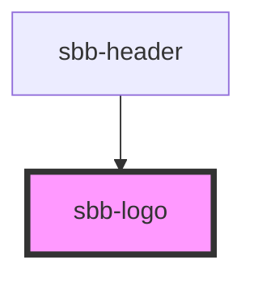

The `sbb-logo` is used as a wrapper for the SBB logo and ensures his aspect ratio and protective room. 
To use the component, please define the desired height or width on `sbb-logo`.

```html
<style>
  sbb-logo {
    height: 20px;
  }
</style>
<sbb-logo></sbb-logo>
```

## Style

The component has a negative variant which can be set using the `negative` property.

```html
<sbb-logo negative></sbb-logo>
```

The aspect ratio of the logo can be changed using the `protectiveRoom` property. 
Possible values are `ideal` (default), `minimal` and `none`.

```html
<sbb-logo protective-room='minimal'></sbb-logo>
```

<!-- Auto Generated Below -->


## Properties

| Property             | Attribute             | Description                                                  | Type                             | Default   |
| -------------------- | --------------------- | ------------------------------------------------------------ | -------------------------------- | --------- |
| `accessibilityLabel` | `accessibility-label` | Accessibility label which will be forwarded to the SVG logo. | `string`                         | `'Logo'`  |
| `negative`           | `negative`            | Variants of the logo.                                        | `boolean`                        | `false`   |
| `protectiveRoom`     | `protective-room`     | Visual protective room around logo.                          | `"ideal" \| "minimal" \| "none"` | `'ideal'` |


## Dependencies

### Used by

 - [sbb-header](../sbb-header)

### Graph


----------------------------------------------


