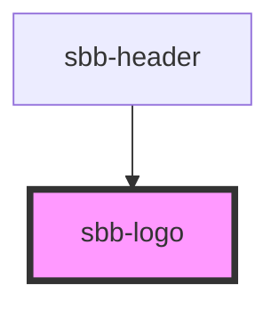

# sbb-sbb-logo

<!-- Auto Generated Below -->

## Properties

| Property         | Attribute         | Description                                                                         | Type                                                                          | Default     |
| ---------------- | ----------------- | ----------------------------------------------------------------------------------- | ----------------------------------------------------------------------------- | ----------- |
| `protectiveRoom` | `protective-room` | The Logo needs to have a certain protective room around it                          | `"ideal" \| "minimal" \| "none"`                                              | `'ideal'`   |
| `variant`        | `variant`         | According to the Corporate Design Guidelines the logo can be used in these variants | `"black-on-white" \| "default" \| "negative" \| "on-red" \| "white-on-black"` | `'default'` |

## Dependencies

### Used by

 - [sbb-header](../sbb-header)

### Graph

----------------------------------------------

