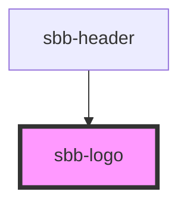

# sbb-sbb-logo

The `<sbb-logo>` ensures his aspect ratio and protective room. To use the logo, 
please define the desired height or width on `<sbb-logo>`.

## Usage
```html
<sbb-logo protective-room="none" style="height: 20px;"></sbb-logo>
```

<!-- Auto Generated Below -->


## Properties

| Property         | Attribute         | Description                         | Type                             | Default   |
| ---------------- | ----------------- | ----------------------------------- | -------------------------------- | --------- |
| `negative`       | `negative`        | Variants of the logo.               | `boolean`                        | `false`   |
| `protectiveRoom` | `protective-room` | Visual protective room around logo. | `"ideal" \| "minimal" \| "none"` | `'ideal'` |


## Dependencies

### Used by

 - [sbb-header](../sbb-header)

### Graph


----------------------------------------------