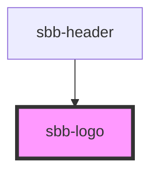

# sbb-sbb-logo

<!-- Auto Generated Below -->

## Properties

| Property         | Attribute         | Description                         | Type                                                                          | Default     |
| ---------------- | ----------------- | ----------------------------------- | ----------------------------------------------------------------------------- | ----------- |
| `protectiveRoom` | `protective-room` | Visual protective room around logo. | `"ideal" \| "minimal" \| "none"`                                              | `'ideal'`   |
| `variant`        | `variant`         | Variants of the logo.               | `"black-on-white" \| "default" \| "negative" \| "on-red" \| "white-on-black"` | `'default'` |

## Dependencies

### Used by

 - [sbb-header](../sbb-header)

### Graph

----------------------------------------------

