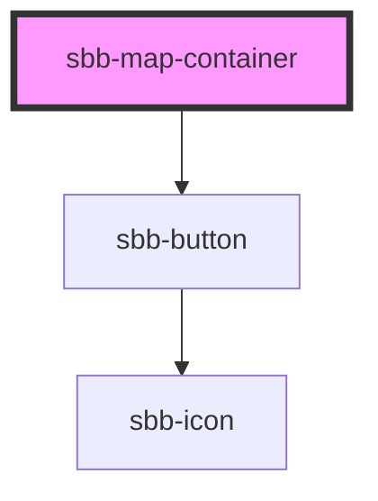

# sbb-map-container

This component is the layout container for e.g. the disruption map or the level 3 navigation. It provides two slots.
One unnamed slot for the sidebar content and one named ("map") slot for map. On mobile the map is sticky above the
sidebar and the sidebar content is scrolling over the map. On desktop, the sidebar and the map are in a two column 
layout side by side. The component comes along with a height calculation that subtracts the height of the header for 
the height of the component. The header height can be overridden with --sbb-map-container-margin-start if needed.

<!-- Auto Generated Below -->

## Properties

| Property             | Attribute               | Description                                                          | Type      | Default |
| -------------------- | ----------------------- | -------------------------------------------------------------------- | --------- | ------- |
| `hideScrollUpButton` | `hide-scroll-up-button` | Flag to show/hide the scroll up button inside the sidebar on mobile. | `boolean` | `false` |

## Slots

| Slot        | Description                            |
| ----------- | -------------------------------------- |
| `"map"`     | Used for slotting the map.             |
| `"unnamed"` | Used for slotting the sidebar content. |

## Dependencies

### Depends on

- [sbb-button](../sbb-button)

### Graph

----------------------------------------------

