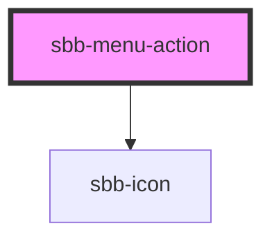

# **name**

<!-- Auto Generated Below -->

## Properties

| Property                   | Attribute                   | Description                                              | Type                              | Default                         |
| -------------------------- | --------------------------- | -------------------------------------------------------- | --------------------------------- | ------------------------------- |
| `accessibilityDescribedby` | `accessibility-describedby` | Documentation for the prop                               | `string`                          | `undefined`                     |
| `accessibilityLabel`       | `accessibility-label`       | Documentation for the prop                               | `string`                          | `undefined`                     |
| `accessibilityLabelledby`  | `accessibility-labelledby`  | Documentation for the prop                               | `string`                          | `undefined`                     |
| `amount`                   | `amount`                    | Documentation for amount                                 | `string`                          | `undefined`                     |
| `disabled`                 | `disabled`                  | Documentation for the prop                               | `boolean`                         | `undefined`                     |
| `download`                 | `download`                  | Documentation for the prop                               | `boolean`                         | `undefined`                     |
| `eventId`                  | `event-id`                  | Documentation for the prop                               | `string`                          | `undefined`                     |
| `form`                     | `form`                      | Form attribute if link is used as button                 | `string`                          | `undefined`                     |
| `href`                     | `href`                      | Documentation for the prop                               | `string`                          | `undefined`                     |
| `icon`                     | `icon`                      | Documentation for icon                                   | `string`                          | `undefined`                     |
| `menuActionId`             | `menu-action-id`            | This id will be forwarded to the relevant inner element. | `string`                          | ``sbb-menu-action-${++nextId}`` |
| `name`                     | `name`                      | Documentation for the prop                               | `string`                          | `undefined`                     |
| `type`                     | `type`                      | Documentation for the prop                               | `"button" \| "reset" \| "submit"` | `undefined`                     |

## Events

| Event                   | Description                                | Type               |
| ----------------------- | ------------------------------------------ | ------------------ |
| `sbb-menu-action_click` | Emits whenever the menu action is clicked. | `CustomEvent<any>` |

## Dependencies

### Depends on

- [sbb-icon](../sbb-icon)

### Graph

----------------------------------------------

