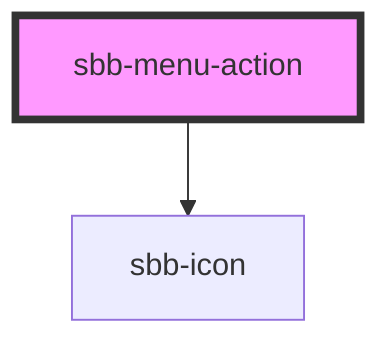

# sbb-menu-action

The component represents an action element contained by the [sbb-menu](../sbb-menu/readme.md) component.

As the [sbb-link](../sbb-link/readme.md), it can be internally rendered as a button or as a link,
depending on the value of the `href` property.

An [sbb-icon](../sbb-icon/readme.md) will be rendered via the `icon` property; otherwise consumers can provide
their own SVG via slot.

An amount can be rendered at the end of the action element as white text in a red circle via the `amount` property. 

<!-- Auto Generated Below -->

## Properties

| Property                   | Attribute                   | Description                                                                     | Type                              | Default                         |
| -------------------------- | --------------------------- | ------------------------------------------------------------------------------- | --------------------------------- | ------------------------------- |
| `accessibilityDescribedby` | `accessibility-describedby` | This will be forwarded as aria-describedby to the relevant nested element.      | `string`                          | `undefined`                     |
| `accessibilityLabel`       | `accessibility-label`       | This will be forwarded as aria-label to the relevant nested element.            | `string`                          | `undefined`                     |
| `accessibilityLabelledby`  | `accessibility-labelledby`  | This will be forwarded as aria-labelledby to the relevant nested element.       | `string`                          | `undefined`                     |
| `amount`                   | `amount`                    | Value shown as badge at component end.                                          | `string`                          | `undefined`                     |
| `disabled`                 | `disabled`                  | Whether the button is disabled.                                                 | `boolean`                         | `undefined`                     |
| `download`                 | `download`                  | Whether the browser will show the download dialog on click.                     | `boolean`                         | `undefined`                     |
| `eventId`                  | `event-id`                  | Id sent in the click event payload.                                             | `string`                          | `undefined`                     |
| `form`                     | `form`                      | The <form> element to associate the button with.                                | `string`                          | `undefined`                     |
| `href`                     | `href`                      | The href value you want to link to.                                             | `string`                          | `undefined`                     |
| `icon`                     | `icon`                      | The name property passed to `sbb-icon` component.                               | `string`                          | `undefined`                     |
| `menuActionId`             | `menu-action-id`            | This id will be forwarded to the relevant inner element.                        | `string`                          | ``sbb-menu-action-${++nextId}`` |
| `name`                     | `name`                      | The name of the button.                                                         | `string`                          | `undefined`                     |
| `rel`                      | `rel`                       | The relationship of the linked URL as space-separated link types.               | `string`                          | `undefined`                     |
| `target`                   | `target`                    | Where to display the linked URL.                                                | `string`                          | `undefined`                     |
| `type`                     | `type`                      | Default behaviour of the button.                                                | `"button" \| "reset" \| "submit"` | `undefined`                     |
| `value`                    | `value`                     | The value associated with button `name` when it's submitted with the form data. | `string`                          | `undefined`                     |

## Events

| Event                   | Description                                | Type               |
| ----------------------- | ------------------------------------------ | ------------------ |
| `sbb-menu-action_click` | Emits whenever the menu action is clicked. | `CustomEvent<any>` |

## Dependencies

### Depends on

- [sbb-icon](../sbb-icon)

### Graph

----------------------------------------------

