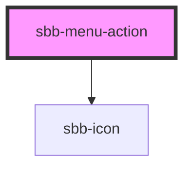

# **name**

<!-- Auto Generated Below -->

## Properties

| Property | Attribute | Description              | Type     | Default     |
| -------- | --------- | ------------------------ | -------- | ----------- |
| `amount` | `amount`  | Documentation for amount | `string` | `undefined` |
| `icon`   | `icon`    | Documentation for icon   | `string` | `undefined` |

## Events

| Event                   | Description                                          | Type               |
| ----------------------- | ---------------------------------------------------- | ------------------ |
| `sbb-menu-action_click` | Emits whenever the menu action click event triggers. | `CustomEvent<any>` |

## Slots

| Slot        | Description                  |
| ----------- | ---------------------------- |
| `"unnamed"` | Use this to document a slot. |

## Dependencies

### Depends on

- [sbb-icon](../sbb-icon)

### Graph

----------------------------------------------

