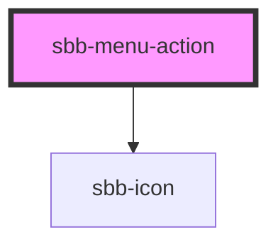

# sbb-menu-action

The component represents an action element contained by the [sbb-menu](../sbb-menu/readme.md) component.

As the [sbb-link](../sbb-link/readme.md), it can be internally rendered as a button or as a link,
depending on the value of the `href` property.

An [sbb-icon](../sbb-icon/readme.md) will be rendered via the `icon-name` property; otherwise consumers can provide
their own content via slot named `icon`.

An amount can be rendered at the end of the action element as white text in a red circle via the `amount` property. 

### Spacing

For cases where smaller outer paddings are needed, 
you can set the css variable `--sbb-menu-action-outer-horizontal-padding` to your desired outer padding.

<!-- Auto Generated Below -->

## Properties

| Property                   | Attribute                   | Description                                                                                                                                                                                                                     | Type                                                            | Default                         |
| -------------------------- | --------------------------- | ------------------------------------------------------------------------------------------------------------------------------------------------------------------------------------------------------------------------------- | --------------------------------------------------------------- | ------------------------------- |
| `accessibilityControls`    | `accessibility-controls`    | When an interaction of this button has an impact on another element(s) in the document, the id of that element(s) needs to be set. The value will be forwarded to the 'aria-controls' attribute to the relevant nested element. | `string`                                                        | `undefined`                     |
| `accessibilityDescribedby` | `accessibility-describedby` | This will be forwarded as aria-describedby to the relevant nested element.                                                                                                                                                      | `string`                                                        | `undefined`                     |
| `accessibilityHaspopup`    | `accessibility-haspopup`    | If you use the button to trigger another widget which itself is covering the page, you must provide an according attribute for aria-haspopup.                                                                                   | `"dialog" \| "grid" \| "listbox" \| "menu" \| "tree" \| "true"` | `undefined`                     |
| `accessibilityLabel`       | `accessibility-label`       | This will be forwarded as aria-label to the relevant nested element.                                                                                                                                                            | `string`                                                        | `undefined`                     |
| `accessibilityLabelledby`  | `accessibility-labelledby`  | This will be forwarded as aria-labelledby to the relevant nested element.                                                                                                                                                       | `string`                                                        | `undefined`                     |
| `amount`                   | `amount`                    | Value shown as badge at component end.                                                                                                                                                                                          | `string`                                                        | `undefined`                     |
| `disabled`                 | `disabled`                  | Whether the button is disabled.                                                                                                                                                                                                 | `boolean`                                                       | `false`                         |
| `download`                 | `download`                  | Whether the browser will show the download dialog on click.                                                                                                                                                                     | `boolean`                                                       | `undefined`                     |
| `form`                     | `form`                      | The <form> element to associate the button with.                                                                                                                                                                                | `string`                                                        | `undefined`                     |
| `href`                     | `href`                      | The href value you want to link to (if it is not present menu action becomes a button).                                                                                                                                         | `string`                                                        | `undefined`                     |
| `iconName`                 | `icon-name`                 | The name of the icon, choose from the small icon variants from the ui-icons category from here https://lyne.sbb.ch/tokens/icons/.                                                                                               | `string`                                                        | `undefined`                     |
| `menuActionId`             | `menu-action-id`            | This id will be forwarded to the relevant inner element.                                                                                                                                                                        | `string`                                                        | ``sbb-menu-action-${++nextId}`` |
| `name`                     | `name`                      | The name attribute to use for the button.                                                                                                                                                                                       | `string`                                                        | `undefined`                     |
| `rel`                      | `rel`                       | The relationship of the linked URL as space-separated link types.                                                                                                                                                               | `string`                                                        | `undefined`                     |
| `target`                   | `target`                    | Where to display the linked URL.                                                                                                                                                                                                | `string`                                                        | `undefined`                     |
| `type`                     | `type`                      | The type attribute to use for the button.                                                                                                                                                                                       | `"button" \| "reset" \| "submit"`                               | `undefined`                     |
| `value`                    | `value`                     | The value attribute to use for the button.                                                                                                                                                                                      | `string`                                                        | `undefined`                     |

## Events

| Event                   | Description                      | Type               |
| ----------------------- | -------------------------------- | ------------------ |
| `sbb-menu-action_click` | Emits the event on button click. | `CustomEvent<any>` |

## Slots

| Slot        | Description                                                                   |
| ----------- | ----------------------------------------------------------------------------- |
| `"icon"`    | Use this slot to provide an icon. If `icon` is set, an sbb-icon will be used. |
| `"unnamed"` | Use this slot to provide the menu action label.                               |

## Dependencies

### Depends on

- [sbb-icon](../sbb-icon)

### Graph

----------------------------------------------

