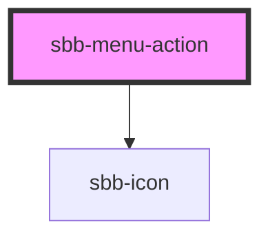

The component represents an action element contained by the [sbb-menu](/docs/components-sbb-menu-sbb-menu--docs) component.

## Slots

It is possible to provide a label via an unnamed slot; the component can optionally display a `sbb-icon`
at the component start using the `iconName` property or via custom content using the `icon` slot.

```html
<sbb-menu-action>Text</sbb-menu-action>

<sbb-menu-action icon-name='pie-small'>Another text</sbb-menu-action>
```

An amount can be rendered at the end of the action element as white text in a red circle via the `amount` property.

```html
<sbb-menu-action amount='123'>Amount text</sbb-menu-action>
```

## Link / button properties

As the [sbb-link](/docs/components-sbb-link--docs) and the [sbb-button](/docs/components-sbb-button--docs),
the component can be internally rendered as a button or as a link,
depending on the value of the `href` property, so the associated properties are available
(`href`, `target`, `rel` and `download` for link; `type`, `name`, `value` and `form` for button).

```html
<sbb-menu-action href="#info" target='_blank'>Link</sbb-menu-action>

<sbb-menu-action type='button' value='menu' name='menu'>Button</sbb-menu-action>
```

## Style

For cases where smaller outer paddings are needed, 
you can set the css variable `--sbb-menu-action-outer-horizontal-padding` to your desired outer padding.

<!-- Auto Generated Below -->


## Properties

| Property   | Attribute   | Description                                                                                                              | Type                              | Default     |
| ---------- | ----------- | ------------------------------------------------------------------------------------------------------------------------ | --------------------------------- | ----------- |
| `amount`   | `amount`    | Value shown as badge at component end.                                                                                   | `string`                          | `undefined` |
| `disabled` | `disabled`  | Whether the button is disabled.                                                                                          | `boolean`                         | `false`     |
| `download` | `download`  | Whether the browser will show the download dialog on click.                                                              | `boolean`                         | `undefined` |
| `form`     | `form`      | The <form> element to associate the button with.                                                                         | `string`                          | `undefined` |
| `href`     | `href`      | The href value you want to link to (if it is not present menu action becomes a button).                                  | `string`                          | `undefined` |
| `iconName` | `icon-name` | The name of the icon, choose from the small icon variants from the ui-icons category from here https://icons.app.sbb.ch. | `string`                          | `undefined` |
| `name`     | `name`      | The name attribute to use for the button.                                                                                | `string`                          | `undefined` |
| `rel`      | `rel`       | The relationship of the linked URL as space-separated link types.                                                        | `string`                          | `undefined` |
| `target`   | `target`    | Where to display the linked URL.                                                                                         | `string`                          | `undefined` |
| `type`     | `type`      | The type attribute to use for the button.                                                                                | `"button" \| "reset" \| "submit"` | `undefined` |
| `value`    | `value`     | The value attribute to use for the button.                                                                               | `string`                          | `undefined` |


## Slots

| Slot        | Description                                                                       |
| ----------- | --------------------------------------------------------------------------------- |
| `"icon"`    | Use this slot to provide an icon. If `icon-name` is set, a sbb-icon will be used. |
| `"unnamed"` | Use this slot to provide the menu action label.                                   |


## Dependencies

### Depends on

- [sbb-icon](../sbb-icon)

### Graph


----------------------------------------------


