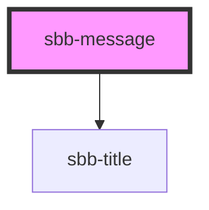

The `sbb-message` component can be used to display a complex message.

### Slots 

It renders by default a `sbb-title`, which can be provided via `titleContent` property or `title` slot.
Optionally, the user can provide other elements such as a subtitle paragraph via the `subtitle` slot, 
a `sbb-image` to provide an image via the `image` slot, a paragraph to provide an error code via the `legend` slot, 
and an `sbb-button` to provide a custom action via the `action` slot.

```html
<sbb-message title-content="Title" title-level="3">
  <sbb-image slot="image" [...]></sbb-image>
  <p slot="subtitle">Subtitle</p>
  <p slot="legend">Error code: 0001</p>
  <sbb-button slot="action" [...]>Action</sbb-button>
</sbb-message>
```

## Accessibility

By default, the `sbb-title` has a visual level of 5 and an actual level of 3. This can be changed by the user
via the `title-level` property. As all other elements are regularly slotted, their accessibility relies 
on the standard techniques provided by the used components (e.g., alt text and aria-label).

<!-- Auto Generated Below -->


## Properties

| Property       | Attribute       | Description                                                                         | Type                                     | Default     |
| -------------- | --------------- | ----------------------------------------------------------------------------------- | ---------------------------------------- | ----------- |
| `titleContent` | `title-content` | Content of title.                                                                   | `string`                                 | `undefined` |
| `titleLevel`   | `title-level`   | Level of title, it will be rendered as heading tag (e.g., h3). Defaults to level 3. | `"1" \| "2" \| "3" \| "4" \| "5" \| "6"` | `'3'`       |


## Slots

| Slot         | Description                                               |
| ------------ | --------------------------------------------------------- |
| `"action"`   | Use this slot to provide a sbb-button.                    |
| `"image"`    | Use this slot to provide a sbb-image component.           |
| `"legend"`   | Use this slot to provide a legend, must be a paragraph.   |
| `"subtitle"` | Use this slot to provide a subtitle, must be a paragraph. |
| `"title"`    | Use this slot to provide title text for the component.    |


## Dependencies

### Depends on

- [sbb-title](../sbb-title)

### Graph


----------------------------------------------


