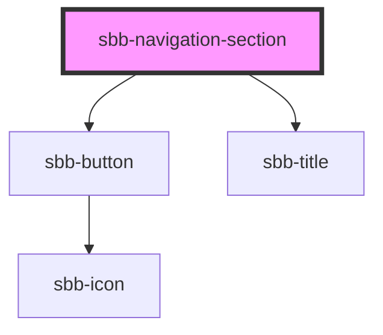

# sbb-navigation-section

<!-- Auto Generated Below -->

## Properties

| Property                   | Attribute                   | Description                                                                                                        | Type                                     | Default                                      |
| -------------------------- | --------------------------- | ------------------------------------------------------------------------------------------------------------------ | ---------------------------------------- | -------------------------------------------- |
| `accessibilityBackLabel`   | `accessibility-back-label`  | This will be forwarded as aria-label to the back button element.                                                   | `string`                                 | `undefined`                                  |
| `accessibilityDescribedby` | `accessibility-describedby` | This will be forwarded as aria-describedby to the relevant nested element.                                         | `string`                                 | `undefined`                                  |
| `accessibilityLabel`       | `accessibility-label`       | This will be forwarded as aria-label to the relevant nested element.                                               | `string`                                 | `undefined`                                  |
| `accessibilityLabelledby`  | `accessibility-labelledby`  | This will be forwarded as aria-labelledby to the relevant nested element.                                          | `string`                                 | `undefined`                                  |
| `disableAnimation`         | `disable-animation`         | Whether the animation is enabled.                                                                                  | `boolean`                                | `false`                                      |
| `navigationSectionId`      | `navigation-section-id`     | This id will be forwarded to the relevant inner element.                                                           | `string`                                 | ``sbb-navigation-section-${++nextId}``       |
| `titleContent`             | `title-content`             |                                                                                                                    | `string`                                 | `undefined`                                  |
| `titleId`                  | `title-id`                  |                                                                                                                    | `string`                                 | ``sbb-navigation-section-title-${++nextId}`` |
| `titleLevel`               | `title-level`               |                                                                                                                    | `"1" \| "2" \| "3" \| "4" \| "5" \| "6"` | `'2'`                                        |
| `trigger`                  | `trigger`                   | The element that will trigger the navigation section. Accepts both a string (id of an element) or an HTML element. | `HTMLElement \| string`                  | `undefined`                                  |

## Events

| Event      | Description                                      | Type                |
| ---------- | ------------------------------------------------ | ------------------- |
| `didClose` | Emits whenever the navigation section is closed. | `CustomEvent<void>` |

## Methods

### `close() => Promise<void>`

Closes the navigation section.

#### Returns

Type: `Promise<void>`

### `open() => Promise<void>`

Opens the navigation section on trigger click.

#### Returns

Type: `Promise<void>`

## Slots

| Slot        | Description                  |
| ----------- | ---------------------------- |
| `"unnamed"` | Use this to document a slot. |

## Dependencies

### Depends on

- [sbb-button](../sbb-button)
- [sbb-title](../sbb-title)

### Graph

----------------------------------------------

