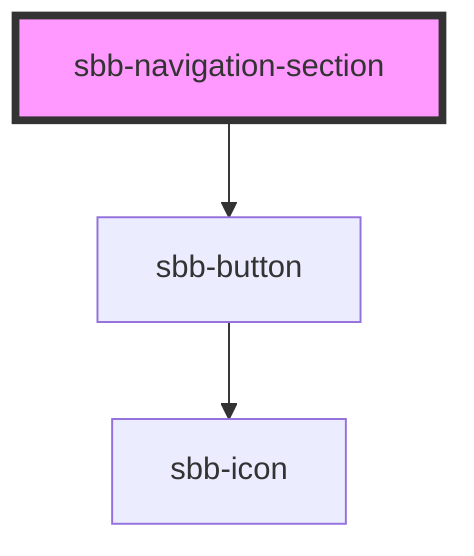

# sbb-navigation-section

<!-- Auto Generated Below -->

## Properties

| Property                 | Attribute                  | Description                                                                                                        | Type                                     | Default     |
| ------------------------ | -------------------------- | ------------------------------------------------------------------------------------------------------------------ | ---------------------------------------- | ----------- |
| `accessibilityBackLabel` | `accessibility-back-label` | This will be forwarded as aria-label to the back button element.                                                   | `string`                                 | `undefined` |
| `accessibilityLabel`     | `accessibility-label`      | This will be forwarded as aria-label to the relevant nested element.                                               | `string`                                 | `undefined` |
| `disableAnimation`       | `disable-animation`        | Whether the animation is enabled.                                                                                  | `boolean`                                | `false`     |
| `titleContent`           | `title-content`            |                                                                                                                    | `string`                                 | `undefined` |
| `titleLevel`             | `title-level`              |                                                                                                                    | `"1" \| "2" \| "3" \| "4" \| "5" \| "6"` | `'2'`       |
| `trigger`                | `trigger`                  | The element that will trigger the navigation section. Accepts both a string (id of an element) or an HTML element. | `HTMLElement \| string`                  | `undefined` |

## Methods

### `close() => Promise<void>`

Closes the navigation section.

#### Returns

Type: `Promise<void>`

### `open() => Promise<void>`

Opens the navigation section on trigger click.

#### Returns

Type: `Promise<void>`

## Slots

| Slot        | Description                                                    |
| ----------- | -------------------------------------------------------------- |
| `"unnamed"` | Use this to project any content inside the navigation section. |

## Dependencies

### Depends on

- [sbb-button](../sbb-button)

### Graph

----------------------------------------------

