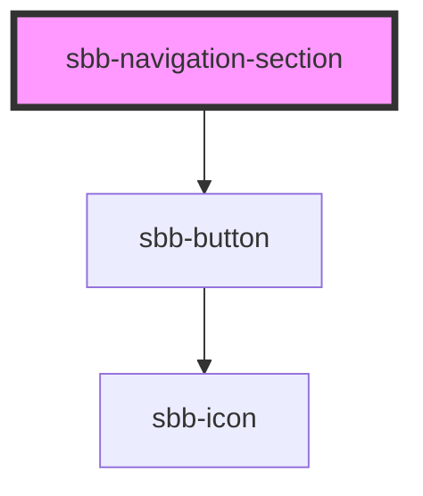

The `<sbb-navigation-section>` is a container for both [sbb-navigation-list](../sbb-navigation-list/readme.md) and [sbb-button](../sbb-button/readme.md). 

Optionally a label can be provided via slot.

Its intended use is inside a [sbb-navigation](../sbb-navigation/readme.md) component.

## Usage
```html
<sbb-navigation-section trigger="nav1" label="Title 1">
    <sbb-navigation-list label="Label 1.1">
      <sbb-navigation-action aria-current="page" href="...">Label 1.1.1</sbb-navigation-action>
      <sbb-navigation-action href="...">Label 1.1.2</sbb-navigation-action>
      ...
    </sbb-navigation-list>
    <sbb-button>Something</sbb-button>
</sbb-navigation-section>
```

## Accessibility

When a navigation action is marked to indicate the user is currently on that page, `aria-current="page"` should be set on that action. Similarly, if a navigation action is marked to indicate a selected option (e.g. the selected language) `aria-pressed` should be set on that action.

<!-- Auto Generated Below -->


## Properties

| Property                 | Attribute                  | Description                                                                                                        | Type                    | Default     |
| ------------------------ | -------------------------- | ------------------------------------------------------------------------------------------------------------------ | ----------------------- | ----------- |
| `accessibilityBackLabel` | `accessibility-back-label` | This will be forwarded as aria-label to the back button element.                                                   | `string`                | `undefined` |
| `accessibilityLabel`     | `accessibility-label`      | This will be forwarded as aria-label to the dialog and is read as a title of the navigation-section.               | `string`                | `undefined` |
| `disableAnimation`       | `disable-animation`        | Whether the animation is enabled.                                                                                  | `boolean`               | `false`     |
| `titleContent`           | `title-content`            |                                                                                                                    | `string`                | `undefined` |
| `trigger`                | `trigger`                  | The element that will trigger the navigation section. Accepts both a string (id of an element) or an HTML element. | `HTMLElement \| string` | `undefined` |


## Methods

### `close() => Promise<void>`

Closes the navigation section.

#### Returns

Type: `Promise<void>`


### `open() => Promise<void>`

Opens the navigation section on trigger click.

#### Returns

Type: `Promise<void>`


## Slots

| Slot        | Description                                                    |
| ----------- | -------------------------------------------------------------- |
| `"unnamed"` | Use this to project any content inside the navigation section. |


## Dependencies

### Depends on

- [sbb-button](../sbb-button)

### Graph


----------------------------------------------


