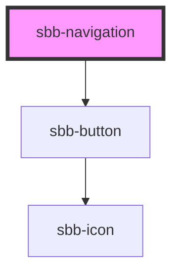

# sbb-navigation

<!-- Auto Generated Below -->

## Properties

| Property                   | Attribute                   | Description                                                                                                | Type                    | Default                    |
| -------------------------- | --------------------------- | ---------------------------------------------------------------------------------------------------------- | ----------------------- | -------------------------- |
| `accessibilityCloseLabel`  | `accessibility-close-label` | This will be forwarded as aria-label to the close button element.                                          | `string`                | `undefined`                |
| `accessibilityDescribedby` | `accessibility-describedby` | This will be forwarded as aria-describedby to the relevant nested element.                                 | `string`                | `undefined`                |
| `accessibilityLabel`       | `accessibility-label`       | This will be forwarded as aria-label to the relevant nested element.                                       | `string`                | `undefined`                |
| `accessibilityLabelledby`  | `accessibility-labelledby`  | This will be forwarded as aria-labelledby to the relevant nested element.                                  | `string`                | `undefined`                |
| `disableAnimation`         | `disable-animation`         | Whether the animation is enabled.                                                                          | `boolean`               | `false`                    |
| `navigationId`             | `navigation-id`             | This id will be forwarded to the relevant inner element.                                                   | `string`                | ``sbb-dialog-${++nextId}`` |
| `trigger`                  | `trigger`                   | The element that will trigger the navigation. Accepts both a string (id of an element) or an HTML element. | `HTMLElement \| string` | `undefined`                |

## Events

| Event                       | Description                                                  | Type                |
| --------------------------- | ------------------------------------------------------------ | ------------------- |
| `sbb-navigation_did-close`  | Emits whenever the navigation is closed.                     | `CustomEvent<void>` |
| `sbb-navigation_did-open`   | Emits whenever the navigation is opened.                     | `CustomEvent<void>` |
| `sbb-navigation_will-close` | Emits whenever the navigation begins the closing transition. | `CustomEvent<void>` |
| `sbb-navigation_will-open`  | Emits whenever the navigation starts the opening transition. | `CustomEvent<void>` |

## Methods

### `close() => Promise<void>`

Closes the navigation.

#### Returns

Type: `Promise<void>`

### `open() => Promise<void>`

Opens the navigation on trigger click.

#### Returns

Type: `Promise<void>`

## Dependencies

### Depends on

- [sbb-button](../sbb-button)

### Graph

----------------------------------------------

