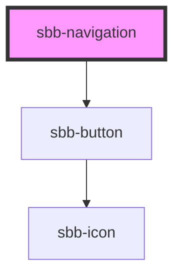

# sbb-navigation

<!-- Auto Generated Below -->

## Properties

| Property                  | Attribute                   | Description                                                                                                | Type                    | Default     |
| ------------------------- | --------------------------- | ---------------------------------------------------------------------------------------------------------- | ----------------------- | ----------- |
| `accessibilityCloseLabel` | `accessibility-close-label` | This will be forwarded as aria-label to the close button element.                                          | `string`                | `undefined` |
| `accessibilityLabel`      | `accessibility-label`       | This will be forwarded as aria-label to the relevant nested element.                                       | `string`                | `undefined` |
| `disableAnimation`        | `disable-animation`         | Whether the animation is enabled.                                                                          | `boolean`               | `false`     |
| `trigger`                 | `trigger`                   | The element that will trigger the navigation. Accepts both a string (id of an element) or an HTML element. | `HTMLElement \| string` | `undefined` |

## Events

| Event       | Description                                                  | Type                |
| ----------- | ------------------------------------------------------------ | ------------------- |
| `didClose`  | Emits whenever the navigation is closed.                     | `CustomEvent<void>` |
| `didOpen`   | Emits whenever the navigation is opened.                     | `CustomEvent<void>` |
| `willClose` | Emits whenever the navigation begins the closing transition. | `CustomEvent<void>` |
| `willOpen`  | Emits whenever the navigation begins the opening transition. | `CustomEvent<void>` |

## Methods

### `close() => Promise<void>`

Closes the navigation.

#### Returns

Type: `Promise<void>`

### `open() => Promise<void>`

Opens the navigation.

#### Returns

Type: `Promise<void>`

## Dependencies

### Depends on

- [sbb-button](../sbb-button)

### Graph

----------------------------------------------

