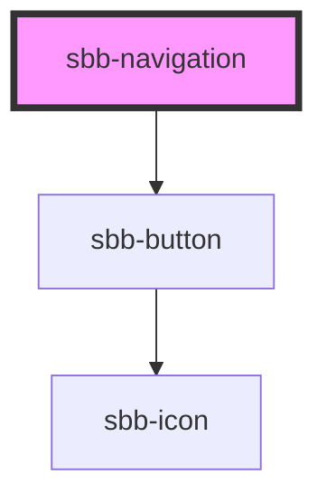

# sbb-navigation

The `<sbb-navigation>` component provides a way to present a navigation menu. 

Some of its features are: 

- uses a native dialog element;
- creates a backdrop, for disabling interaction below the navigation;
- disables scrolling of the page content while open;
- manages focus properly by setting it on the first focusable element;
- can act as a host for components as [sbb-navigation-list](../sbb-navigation-list/readme.md), [sbb-navigation-marker](../sbb-navigation-marker/readme.md) and [sbb-navigation-section](../sbb-navigation-section/readme.md);

## Usage

To display the navigation you can either provide a trigger element or call the `open()` method on the `sbb-navigation` component.

```html
<sbb-navigation trigger="some-button-id">
  <sbb-navigation-marker>
    <sbb-navigation-action id="nav1">Label 1</sbb-navigation-action>
    <sbb-navigation-action id="nav2">Label 2</sbb-navigation-action>
    <sbb-navigation-action href="https://www.sbb.ch/some/route">Label 3</sbb-navigation-action>
  <sbb-navigation-marker>

  <sbb-navigation-section trigger="nav1">
    <span slot="label">Title 1</span>
    <sbb-navigation-list>
      <span slot="label">Label 1.1</span>
      <sbb-navigation-action size="m" href="...">Label 1.1.1</sbb-navigation-action>
      <sbb-navigation-action size="m" href="...">Label 1.1.2</sbb-navigation-action>
      <sbb-navigation-action size="m" href="...">Label 1.1.3</sbb-navigation-action>
    </sbb-navigation-list>
    ...
    <sbb-button>Something</sbb-button>
  </sbb-navigation-section>
  ...
</sbb-navigation>
```

<!-- Auto Generated Below -->


## Properties

| Property                   | Attribute                   | Description                                                                                                | Type                    | Default                        |
| -------------------------- | --------------------------- | ---------------------------------------------------------------------------------------------------------- | ----------------------- | ------------------------------ |
| `accessibilityCloseLabel`  | `accessibility-close-label` | This will be forwarded as aria-label to the close button element.                                          | `string`                | `undefined`                    |
| `accessibilityDescribedby` | `accessibility-describedby` | This will be forwarded as aria-describedby to the relevant nested element.                                 | `string`                | `undefined`                    |
| `accessibilityLabel`       | `accessibility-label`       | This will be forwarded as aria-label to the relevant nested element.                                       | `string`                | `undefined`                    |
| `accessibilityLabelledby`  | `accessibility-labelledby`  | This will be forwarded as aria-labelledby to the relevant nested element.                                  | `string`                | `undefined`                    |
| `disableAnimation`         | `disable-animation`         | Whether the animation is enabled.                                                                          | `boolean`               | `false`                        |
| `navigationId`             | `navigation-id`             | This id will be forwarded to the relevant inner element.                                                   | `string`                | ``sbb-navigation-${++nextId}`` |
| `trigger`                  | `trigger`                   | The element that will trigger the navigation. Accepts both a string (id of an element) or an HTML element. | `HTMLElement \| string` | `undefined`                    |


## Events

| Event       | Description                                                  | Type                |
| ----------- | ------------------------------------------------------------ | ------------------- |
| `didClose`  | Emits whenever the navigation is closed.                     | `CustomEvent<void>` |
| `didOpen`   | Emits whenever the navigation is opened.                     | `CustomEvent<void>` |
| `willClose` | Emits whenever the navigation begins the closing transition. | `CustomEvent<void>` |
| `willOpen`  | Emits whenever the navigation begins the opening transition. | `CustomEvent<void>` |


## Methods

### `close() => Promise<void>`

Closes the navigation.

#### Returns

Type: `Promise<void>`


### `open() => Promise<void>`

Opens the navigation on trigger click.

#### Returns

Type: `Promise<void>`


## Dependencies

### Depends on

- [sbb-button](../sbb-button)

### Graph


----------------------------------------------


