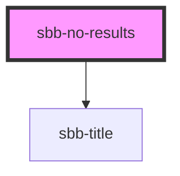

<!-- Auto Generated Below -->

## Properties

| Property       | Attribute       | Description                | Type     | Default     |
| -------------- | --------------- | -------------------------- | -------- | ----------- |
| `titleContent` | `title-content` | Documentation for someProp | `string` | `undefined` |

## Slots

| Slot         | Description                                               |
| ------------ | --------------------------------------------------------- |
| `"action"`   | Use this slot to provide an sbb-button.                   |
| `"image"`    | Use this slot to provide an sbb-image component.          |
| `"legend"`   | Use this slot to provide a legend, must be a paragraph.   |
| `"subtitle"` | Use this slot to provide a subtitle, must be a paragraph. |
| `"title"`    | Use this slot to provide title text for the component.    |

## Dependencies

### Depends on

- [sbb-title](../sbb-title)

### Graph

----------------------------------------------

