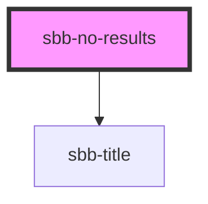

The component renders a `sbb-title` (which can be provided via property or slot) and a subtitle paragraph using the default style of `sbb-no-results` component. Optionally, the user can provide other elements such as a sbb-image to provide an image, a paragraph to provide an error code, and a sbb-button to provide a custom action.

## Usage

```html
<sbb-no-results title-content="Title" title-level="3">
  <sbb-image slot="image" [...]></sbb-image>
  <p slot="subtitle">Subtitle</p>
  <p slot="legend">Error code: 0001</p>
  <sbb-button slot="action" [...]></sbb-button>
</sbb-no-results>
```
## Accessibility
By default the `sbb-title` has a visual level of 5 and an actual level of 3. This can be changed by the user either via the `title-level` property, or via slotting a `sbb-title` in the `title` slot, where it's possible to specify both the visual level and the accessibility level. As all other elements are regularly slotted, their accessibility relies on the standard techniques provided by the used components (e.g. alt text and aria-label).

<!-- Auto Generated Below -->


## Properties

| Property       | Attribute       | Description                | Type     | Default     |
| -------------- | --------------- | -------------------------- | -------- | ----------- |
| `titleContent` | `title-content` | Documentation for someProp | `string` | `undefined` |


## Slots

| Slot         | Description                                               |
| ------------ | --------------------------------------------------------- |
| `"action"`   | Use this slot to provide an sbb-button.                   |
| `"image"`    | Use this slot to provide an sbb-image component.          |
| `"legend"`   | Use this slot to provide a legend, must be a paragraph.   |
| `"subtitle"` | Use this slot to provide a subtitle, must be a paragraph. |
| `"title"`    | Use this slot to provide title text for the component.    |


## Dependencies

### Depends on

- [sbb-title](../sbb-title)

### Graph


----------------------------------------------


