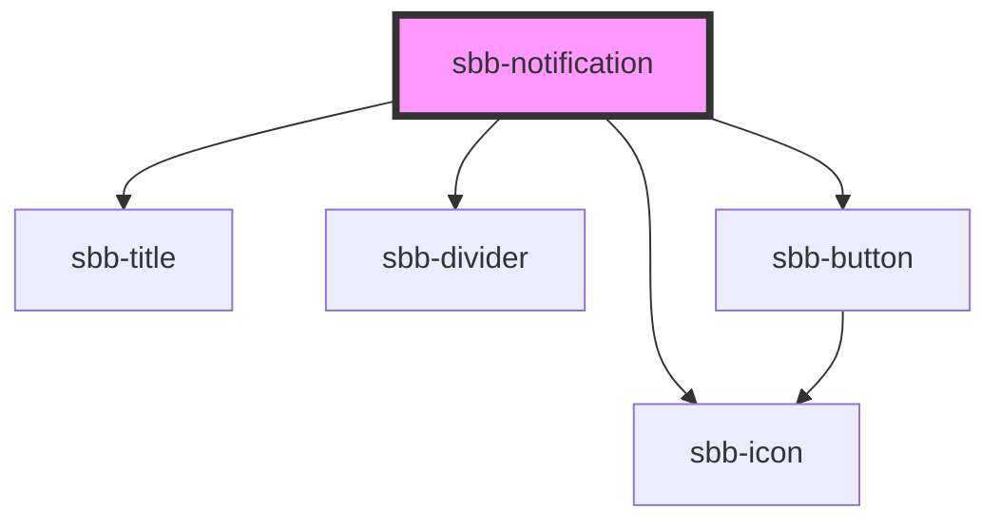

The `sbb-notification` is a component which purpose is to inform users of updates. 
A notification is an element that displays a brief, important message in a way that attracts the user's attention without interrupting the user's task.

Inline notifications show up in task flows, to notify users of an action status or other information. 
They usually appear at the top of the primary content area or close to the item needing attention.

The `sbb-notification` is structured in the following way:
- Icon: informs users of the notification type at a glance.
- Title (optional): gives users a quick overview of the notification.
- Close button (optional): closes the notification.
- Message: provides additional detail and/or actionable steps for the user to take.

```html
<sbb-notification>
  The quick brown fox jumps over the lazy dog. The quick brown fox jumps over the lazy dog.
  <sbb-link variant="inline" href="/">Link one</sbb-link>
  <sbb-link variant="inline" href="/">Link two</sbb-link>
  <sbb-link variant="inline" href="/">Link three</sbb-link>
</sbb-notification>
```

Note that the notification only supports inline links, therefore any slotted link will be forced to be a `variant="inline"` link.

### States

It is possible to display the component in `readonly` state by using the self-named property.
In this case, the close button will not be shown.

```html
<sbb-notification readonly>
  ...
</sbb-notification>
```

### Variants

The `sbb-notification` supports four types: `info` (default), `success`, `warn` and `error`, based on the type of the information displayed.

```html
<sbb-notification type="success">...</sbb-notification>

<sbb-notification type="warn">...</sbb-notification>

<sbb-notification type="error">...</sbb-notification>
```

### Interaction

Inline notifications do not dismiss automatically. 
They persist on the page until the user dismisses them or takes action that resolves the notification.

By default, a close button is displayed to dismiss inline notifications. Including the close button is optional 
and should not be included if it is critical for a user to read or interact with the notification by setting the `readonly` property to `true`.

### Style

If the `sbb-notification` host needs a margin, in order to properly animate it on open/close, 
we suggest using the `--sbb-notification-margin` variable to set it. 
For example, use `--sbb-notification-margin: 0 0 var(--sbb-spacing-fixed-4x) 0` to apply a bottom margin. 

<!-- Auto Generated Below -->


## Properties

| Property           | Attribute           | Description                                                                                             | Type                                       | Default     |
| ------------------ | ------------------- | ------------------------------------------------------------------------------------------------------- | ------------------------------------------ | ----------- |
| `disableAnimation` | `disable-animation` | Whether the animation is enabled.                                                                       | `boolean`                                  | `false`     |
| `readonly`         | `readonly`          | Whether the notification is readonly. In readonly mode, there is no dismiss button offered to the user. | `boolean`                                  | `false`     |
| `titleContent`     | `title-content`     | Content of title.                                                                                       | `string`                                   | `undefined` |
| `titleLevel`       | `title-level`       | Level of title, will be rendered as heading tag (e.g. h3). Defaults to level 3.                         | `"1" \| "2" \| "3" \| "4" \| "5" \| "6"`   | `'3'`       |
| `type`             | `type`              | The type of the notification.                                                                           | `"error" \| "info" \| "success" \| "warn"` | `'info'`    |


## Events

| Event        | Description                                                    | Type                |
| ------------ | -------------------------------------------------------------- | ------------------- |
| `did-close`  | Emits whenever the notification is closed.                     | `CustomEvent<void>` |
| `did-open`   | Emits whenever the notification is opened.                     | `CustomEvent<void>` |
| `will-close` | Emits whenever the notification begins the closing transition. | `CustomEvent<void>` |
| `will-open`  | Emits whenever the notification starts the opening transition. | `CustomEvent<void>` |


## Methods

### `close() => Promise<void>`


#### Returns

Type: `Promise<void>`


## Slots

| Slot        | Description                                          |
| ----------- | ---------------------------------------------------- |
| `"title"`   | Use this to provide a notification title (optional). |
| `"unnamed"` | Use this to provide the notification message.        |


## Dependencies

### Depends on

- [sbb-icon](../sbb-icon)
- [sbb-title](../sbb-title)
- [sbb-divider](../sbb-divider)
- [sbb-button](../sbb-button)

### Graph


----------------------------------------------


