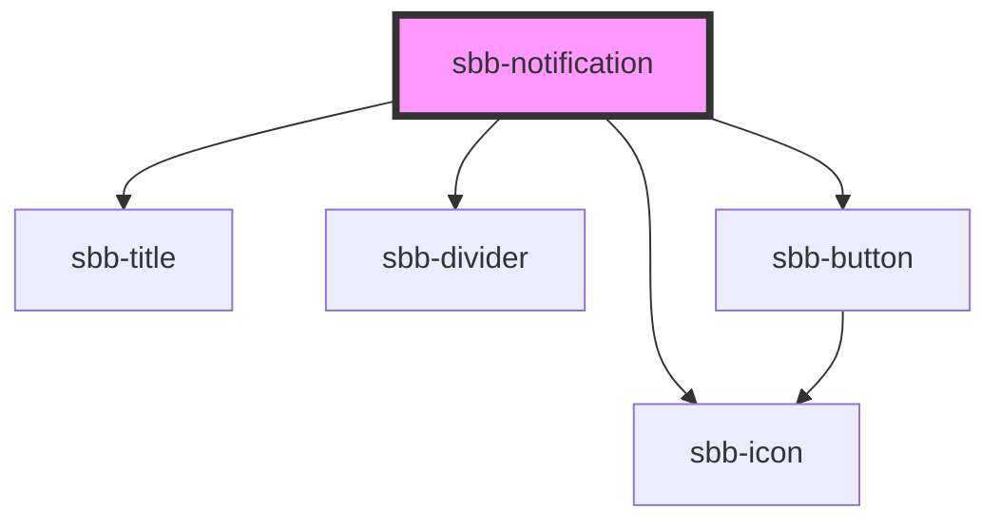

The `sbb-notification` component...

<!-- Auto Generated Below -->

## Properties

| Property           | Attribute           | Description                                                                                      | Type                                       | Default     |
| ------------------ | ------------------- | ------------------------------------------------------------------------------------------------ | ------------------------------------------ | ----------- |
| `disableAnimation` | `disable-animation` | Whether the animation is enabled.                                                                | `boolean`                                  | `false`     |
| `readonly`         | `readonly`          | Whether the alert is readonly. In readonly mode, there is no dismiss button offered to the user. | `boolean`                                  | `false`     |
| `titleContent`     | `title-content`     | Content of title.                                                                                | `string`                                   | `undefined` |
| `titleLevel`       | `title-level`       | Level of title, will be rendered as heading tag (e.g. h3). Defaults to level 3.                  | `"1" \| "2" \| "3" \| "4" \| "5" \| "6"`   | `'3'`       |
| `type`             | `type`              | The type of the notification.                                                                    | `"error" \| "info" \| "success" \| "warn"` | `'info'`    |
| `variant`          | `variant`           | The variant of the notification.                                                                 | `"colorful" \| "default" \| "transparent"` | `'default'` |

## Events

| Event        | Description                                                       | Type                |
| ------------ | ----------------------------------------------------------------- | ------------------- |
| `did-close`  | Emits whenever the content section is closed.                     | `CustomEvent<void>` |
| `did-open`   | Emits whenever the content section is opened.                     | `CustomEvent<void>` |
| `will-close` | Emits whenever the content section begins the closing transition. | `CustomEvent<void>` |
| `will-open`  | Emits whenever the content section starts the opening transition. | `CustomEvent<void>` |

## Methods

### `close() => Promise<void>`

#### Returns

Type: `Promise<void>`

### `open() => Promise<void>`

#### Returns

Type: `Promise<void>`

## Slots

| Slot        | Description                  |
| ----------- | ---------------------------- |
| `"unnamed"` | Use this to document a slot. |

## Dependencies

### Depends on

- [sbb-icon](../sbb-icon)
- [sbb-title](../sbb-title)
- [sbb-divider](../sbb-divider)
- [sbb-button](../sbb-button)

### Graph

----------------------------------------------

