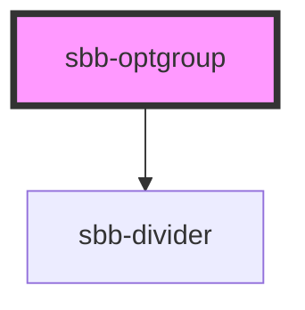

The `sbb-optgroup` is a component used to group more `sbb-option` within a `sbb-autocomplete` or a `sbb-select` component.

It is possible to provide options via an unnamed slot. The component has a `label` property as name of the group; 
if the `disabled` property is set to `true`, all the `sbb-option` in the group are disabled.
A `sbb-divider` is displayed at the bottom of the component.

## Usage

Default:

```html
<sbb-optgroup label="Group">
  <sbb-option value="1" selected>1</sbb-option>
  <sbb-option value="2">2</sbb-option>
  <sbb-option value="3">3</sbb-option>
</sbb-optgroup>
```

Disabled:

```html
<sbb-optgroup label="Disabled group" disabled>
  <sbb-option value="A">A</sbb-option>
  <sbb-option value="B">B</sbb-option>
  <sbb-option value="C">C</sbb-option>
</sbb-optgroup>
```


<!-- Auto Generated Below -->


## Properties

| Property   | Attribute  | Description                     | Type      | Default     |
| ---------- | ---------- | ------------------------------- | --------- | ----------- |
| `disabled` | `disabled` | Whether the group is disabled.  | `boolean` | `false`     |
| `label`    | `label`    | Option group label.             | `string`  | `undefined` |
| `negative` | `negative` | Negative coloring variant flag. | `boolean` | `false`     |


## Slots

| Slot        | Description              |
| ----------- | ------------------------ |
| `"unnamed"` | Used to display options. |


## Dependencies

### Depends on

- [sbb-divider](../sbb-divider)

### Graph


----------------------------------------------


