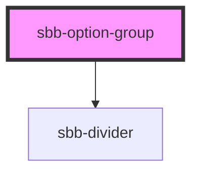

# sbb-option-group

<!-- Auto Generated Below -->

## Properties

| Property   | Attribute  | Description                    | Type      | Default     |
| ---------- | ---------- | ------------------------------ | --------- | ----------- |
| `disabled` | `disabled` | Whether the group is disabled. | `boolean` | `false`     |
| `label`    | `label`    | Option group label.            | `string`  | `undefined` |

## Slots

| Slot        | Description              |
| ----------- | ------------------------ |
| `"unnamed"` | Used to display options. |

## Dependencies

### Depends on

- [sbb-divider](../sbb-divider)

### Graph

----------------------------------------------

