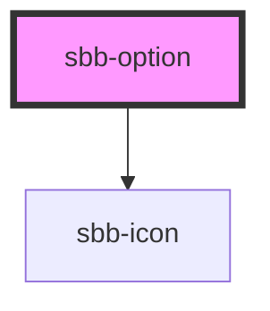

# sbb-option

The `<sbb-option>` implements the design of the Lyne Option, and can be used to display and manage options in components like `<sbb-autocomplete>` or `<sbb-select>`.
If the `icon-name` property is set, it will include the related icon on the left.
Icon space can be reserved even if the icon is not shown.

## Usage

```html
<sbb-option>Option label</sbb-option>
```

Option with icon

```html
<sbb-button icon-name="info">Option label</sbb-button>
```


## Accessibility
-- TBD --


<!-- Auto Generated Below -->


## Properties

| Property                | Attribute                 | Description                                                                                                                               | Type      | Default     |
| ----------------------- | ------------------------- | ----------------------------------------------------------------------------------------------------------------------------------------- | --------- | ----------- |
| `active`                | `active`                  | Whether the option is currently active.                                                                                                   | `boolean` | `undefined` |
| `disableLabelHighlight` | `disable-label-highlight` | Disable the highlight of the label.                                                                                                       | `boolean` | `undefined` |
| `disabled`              | `disabled`                | Whether the option is disabled. TBI: missing disabled style, will be implemented with the select component.                               | `boolean` | `undefined` |
| `iconName`              | `icon-name`               | The icon name we want to use, choose from the small icon variants from the ui-icons category from here https://lyne.sbb.ch/tokens/icons/. | `string`  | `undefined` |
| `selected`              | `selected`                | Whether the option is selected.                                                                                                           | `boolean` | `false`     |
| `value`                 | `value`                   | Value of the option.                                                                                                                      | `string`  | `undefined` |


## Events

| Event                     | Description                                     | Type                                    |
| ------------------------- | ----------------------------------------------- | --------------------------------------- |
| `option-selection-change` | Emits when the option selection status changes. | `CustomEvent<SbbOptionSelectionChange>` |


## Methods

### `highlight(value: string) => Promise<void>`

Highlight the label of the option

#### Returns

Type: `Promise<void>`


## Slots

| Slot        | Description                                                                       |
| ----------- | --------------------------------------------------------------------------------- |
| `"icon"`    | Use this slot to provide an icon. If `icon-name` is set, a sbb-icon will be used. |
| `"unnamed"` | Use this to provide the option label.                                             |


## Dependencies

### Depends on

- [sbb-icon](../sbb-icon)

### Graph


----------------------------------------------


