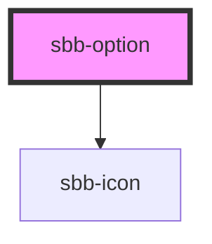

# sbb-option

The `<sbb-option>` component can be used to display items in components like `<sbb-autocomplete>` or `<sbb-select>`.

Like the native `option`, the component has a `value` property. The `selected`, `disabled` and `active` properties are 
connected to the self-named states. When disabled, the selection via click is prevented.
If the `sbb-option` is nested in a `sbb-option-group` component, it inherits from the parent the `disabled` state.

It is possible to provide a label via an unnamed slot; the component can optionally display a `<sbb-icon>`
at the component start using the `iconName` property or via custom content using the `icon` slot. 
Icon space can be reserved even if the `iconName` property is not set by overriding the `--sbb-option-icon-container-display` variable.

Consumers can listen to the `selectionChange` event on the `sbb-option` component to intercept the selected value;
the `event.detail` object includes the `sbb-option` id, value and selected state (as a boolean value).

### Highlight

If the label slot contains only a **text node**, it is possible to search for text in the `sbb-option` using the 
`highlight` method, passing the desired text; if the text is present it will be highlighted in bold.

```html  
<!-- Supported scenario -->
<sbb-option> Highlightable caption</sbb-option>

<!-- Not supported scenarios -->
<sbb-option> 
  <span>Not highlightable caption</span>
</sbb-option>

<sbb-option> 
  
  Highlightable caption 
</sbb-option>
```

## Usage

Default:
```html
<sbb-option value="value">Option label</sbb-option>
```

Selected and active with icon:
```html
<sbb-option value="value" icon-name="info" selected active>Option label</sbb-option>
```

Disabled:
```html
<sbb-option value="value" disabled>Option label</sbb-option>
```

## Accessibility
-- TBD --


<!-- Auto Generated Below -->


## Properties

| Property   | Attribute   | Description                                                                                                                               | Type      | Default     |
| ---------- | ----------- | ----------------------------------------------------------------------------------------------------------------------------------------- | --------- | ----------- |
| `active`   | `active`    | Whether the option is currently active.                                                                                                   | `boolean` | `undefined` |
| `disabled` | `disabled`  | Whether the option is disabled. TBI: missing disabled style, will be implemented with the select component.                               | `boolean` | `undefined` |
| `iconName` | `icon-name` | The icon name we want to use, choose from the small icon variants from the ui-icons category from here https://lyne.sbb.ch/tokens/icons/. | `string`  | `undefined` |
| `selected` | `selected`  | Whether the option is selected.                                                                                                           | `boolean` | `false`     |
| `value`    | `value`     | Value of the option.                                                                                                                      | `string`  | `undefined` |


## Events

| Event                     | Description                                     | Type                                    |
| ------------------------- | ----------------------------------------------- | --------------------------------------- |
| `option-selection-change` | Emits when the option selection status changes. | `CustomEvent<SbbOptionSelectionChange>` |


## Methods

### `highlight(value: string) => Promise<void>`

Highlight the label of the option

#### Returns

Type: `Promise<void>`


### `setGroupLabel(value: string) => Promise<void>`

Set the option group label (used for a11y)

#### Returns

Type: `Promise<void>`


## Slots

| Slot        | Description                                                                       |
| ----------- | --------------------------------------------------------------------------------- |
| `"icon"`    | Use this slot to provide an icon. If `icon-name` is set, a sbb-icon will be used. |
| `"unnamed"` | Use this to provide the option label.                                             |


## Dependencies

### Depends on

- [sbb-icon](../sbb-icon)

### Graph


----------------------------------------------


