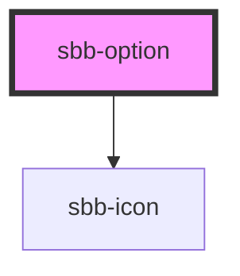

# sbb-option

<!-- Auto Generated Below -->

## Properties

| Property            | Attribute             | Description                                                                                                                               | Type      | Default     |
| ------------------- | --------------------- | ----------------------------------------------------------------------------------------------------------------------------------------- | --------- | ----------- |
| `iconName`          | `icon-name`           | The icon name we want to use, choose from the small icon variants from the ui-icons category from here https://lyne.sbb.ch/tokens/icons/. | `string`  | `undefined` |
| `preserveIconSpace` | `preserve-icon-space` | Wheter the icon space is preserved when no icon is set                                                                                    | `boolean` | `true`      |
| `selected`          | `selected`            |                                                                                                                                           | `boolean` | `undefined` |

## Slots

| Slot        | Description                                                                        |
| ----------- | ---------------------------------------------------------------------------------- |
| `"icon"`    | Use this slot to provide an icon. If `icon-name` is set, an sbb-icon will be used. |
| `"unnamed"` | Use this to provide the option label.                                              |

## Dependencies

### Depends on

- [sbb-icon](../sbb-icon)

### Graph

----------------------------------------------

