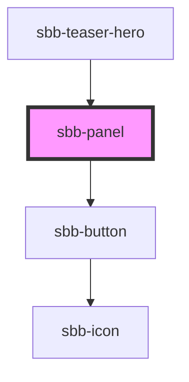

# sbb-panel

<!-- Auto Generated Below -->

## Properties

| Property                  | Attribute     | Description                                                | Type                                                            | Default     |
| ------------------------- | ------------- | ---------------------------------------------------------- | --------------------------------------------------------------- | ----------- |
| `buttonText` _(required)_ | `button-text` | The text to use as button text                             | `string`                                                        | `undefined` |
| `eventId`                 | `event-id`    | Id which is sent in the click event payload for the button | `string`                                                        | `undefined` |
| `tag`                     | `tag`         | The tag to use for the text element                        | `"h1" \| "h2" \| "h3" \| "h4" \| "h5" \| "h6" \| "p" \| "span"` | `'p'`       |
| `text` _(required)_       | `text`        | The text to show in the panel                              | `string`                                                        | `undefined` |

## Dependencies

### Used by

 - [sbb-teaser-hero](../sbb-teaser-hero)

### Depends on

- [sbb-button](../sbb-button)

### Graph

----------------------------------------------

