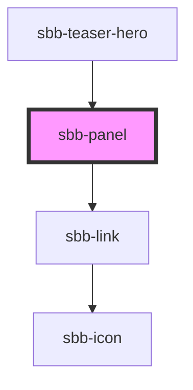

# sbb-panel

For this component you can either use slots or props for the text and link.

# Usage with slots:

````
<sbb-panel {...args}>
  <span slot="text">foo</span>
  <sbb-link negative slot="link">foo</sbb-link>
</sbb-panel>
```

# Usage with props:

````
<sbb-panel {...args}></sbb-panel>
```

<!-- Auto Generated Below -->


## Properties

| Property   | Attribute   | Description               | Type     | Default     |
| ---------- | ----------- | ------------------------- | -------- | ----------- |
| `href`     | `href`      | href for the hero teaser. | `string` | `undefined` |
| `linkText` | `link-text` | Link for the hero teaser. | `string` | `undefined` |
| `text`     | `text`      | Link for the hero teaser. | `string` | `undefined` |


## Dependencies

### Used by

 - [sbb-teaser-hero](../sbb-teaser-hero)

### Depends on

- [sbb-link](../sbb-link)

### Graph


----------------------------------------------


