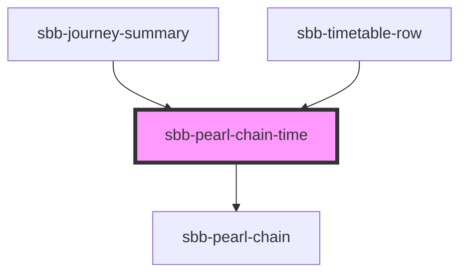

The `sbb-pearl-chain-time` component adds an optional walk icon and a duration in minutes 
before and/or after the [sbb-pearl-chain](/docs/timetable-sbb-pearl-chain--docs).

The walk time indicates that the user has to walk to get to the destination, or to the station to begin the journey.

The `legs` property is mandatory.

```json5
[
  {
    "__typename": "PTRideLeg",
    "arrival": {
      "time": "2022-12-11T12:13:00+01:00"
    },
    "departure": {
      "time": "2022-12-07T12:11:00+01:00"
    },
    "serviceJourney": {
      "serviceAlteration": {
        "cancelled": false,
        "delayText": "string",
        "reachable": true,
        "unplannedStopPointsText": ""
      },
      "notices": [
        {
          "name": "CI",
          "text": {
            "template": "Extended boarding time (45')"
          }
        }
      ]
    }
  }
]
```

```html
<sbb-pearl-chain-time 
  legs={legs} 
  departure-time="20:30"
  arrival-time="21:30" 
  departure-walk="5" 
  arrival-walk="3" 
/>
```

## Testing

To specify a specific date for the current datetime, you can use the `data-now` attribute (timestamp in milliseconds).
This is helpful if you need a specific state of the component.

<!-- Auto Generated Below -->


## Properties

| Property            | Attribute           | Description                                                                                                                                                                                                                                                                   | Type      | Default     |
| ------------------- | ------------------- | ----------------------------------------------------------------------------------------------------------------------------------------------------------------------------------------------------------------------------------------------------------------------------- | --------- | ----------- |
| `arrivalTime`       | `arrival-time`      | Prop to render the arrival time - will be formatted as "H:mm"                                                                                                                                                                                                                 | `string`  | `undefined` |
| `arrivalWalk`       | `arrival-walk`      | Optional prop to render the walk time (in minutes) after arrival                                                                                                                                                                                                              | `number`  | `undefined` |
| `departureTime`     | `departure-time`    | Prop to render the departure time - will be formatted as "H:mm"                                                                                                                                                                                                               | `string`  | `undefined` |
| `departureWalk`     | `departure-walk`    | Optional prop to render the walk time (in minutes) before departure                                                                                                                                                                                                           | `number`  | `undefined` |
| `disableAnimation`  | `disable-animation` | Per default, the current location has a pulsating animation. You can disable the animation with this property.                                                                                                                                                                | `boolean` | `undefined` |
| `legs` _(required)_ | --                  | define the legs of the pearl-chain. Format: `{"legs": [{"duration": 25}, ...]}` `duration` in minutes. Duration of the leg is relative to the total travel time. Example: departure 16:30, change at 16:40, arrival at 17:00. So the change should have a duration of 33.33%. | `Leg[]`   | `undefined` |


## Dependencies

### Used by

 - [sbb-journey-summary](../sbb-journey-summary)
 - [sbb-timetable-row](../sbb-timetable-row)

### Depends on

- [sbb-pearl-chain](../sbb-pearl-chain)

### Graph


----------------------------------------------


