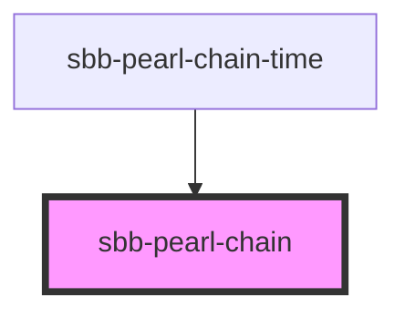

The `<sbb-pearl-chain>` component displays all parts of a journey. Including changes of trains or other kinds of transports. Also it is possible to render the current position.

## Usage

Minimal examples

```html
<sbb-pearl-chain 
  legs={[{__typename: 'PTRideLeg', arrival: { time: '2022-07-31T13:00' }, departure: { time: '2022-07-31T12:00' }]}
/>
```


## Testing

To specify a specific date for the current datetime, you can use the `data-now` attribute (timestamp in milliseconds).
This is helpful if you need a specific state of the component.

<!-- Auto Generated Below -->


## Properties

| Property           | Attribute           | Description                                                                                                                                                                                                                                                                   | Type      | Default     |
| ------------------ | ------------------- | ----------------------------------------------------------------------------------------------------------------------------------------------------------------------------------------------------------------------------------------------------------------------------- | --------- | ----------- |
| `disableAnimation` | `disable-animation` | Per default, the current location has a pulsating animation. You can disable the animation with this property.                                                                                                                                                                | `boolean` | `undefined` |
| `legs`             | --                  | define the legs of the pearl-chain. Format: `{"legs": [{"duration": 25}, ...]}` `duration` in minutes. Duration of the leg is relative to the total travel time. Example: departure 16:30, change at 16:40, arrival at 17:00. So the change should have a duration of 33.33%. | `Leg[]`   | `undefined` |


## Dependencies

### Used by

 - [sbb-pearl-chain-time](../sbb-pearl-chain-time)

### Graph


----------------------------------------------


