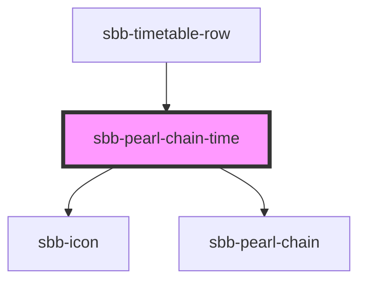

# sbb-pearl-chain-time

<!-- Auto Generated Below -->

## Properties

| Property                     | Attribute           | Description                                                                                                                                                                                                                                                                   | Type      | Default     |
| ---------------------------- | ------------------- | ----------------------------------------------------------------------------------------------------------------------------------------------------------------------------------------------------------------------------------------------------------------------------- | --------- | ----------- |
| `arrivalTime` _(required)_   | `arrival-time`      | Prop to render the arrival time                                                                                                                                                                                                                                               | `string`  | `undefined` |
| `arrivalWalk`                | `arrival-walk`      | Optional prop to render the walk time after arrival                                                                                                                                                                                                                           | `number`  | `undefined` |
| `departureTime` _(required)_ | `departure-time`    | Prop to render the departure time                                                                                                                                                                                                                                             | `string`  | `undefined` |
| `departureWalk`              | `departure-walk`    | Optional prop to render the walk time before departure                                                                                                                                                                                                                        | `number`  | `undefined` |
| `disableAnimation`           | `disable-animation` | Per default, the current location has a pulsating animation. You can disable the animation with this property.                                                                                                                                                                | `boolean` | `undefined` |
| `legs` _(required)_          | --                  | define the legs of the pearl-chain. Format: `{"legs": [{"duration": 25}, ...]}` `duration` in minutes. Duration of the leg is relative to the total travel time. Example: departure 16:30, change at 16:40, arrival at 17:00. So the change should have a duration of 33.33%. | `Leg[]`   | `undefined` |

## Dependencies

### Used by

- [sbb-timetable-row](../../sbb-timetable-row)

### Depends on

- [sbb-icon](../../sbb-icon)
- [sbb-pearl-chain](..)

### Graph

---
