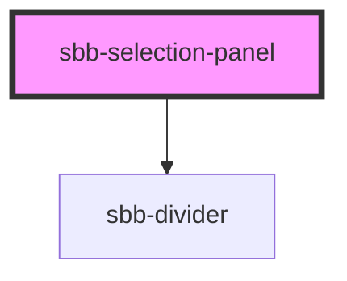

# sbb-selection-panel

<!-- Auto Generated Below -->

## Properties

| Property           | Attribute           | Description                                    | Type                | Default     |
| ------------------ | ------------------- | ---------------------------------------------- | ------------------- | ----------- |
| `color`            | `color`             | The background color of the panel.             | `"milk" \| "white"` | `'white'`   |
| `disableAnimation` | `disable-animation` | Whether the animation is enabled.              | `boolean`           | `false`     |
| `forceOpen`        | `force-open`        | Whether the content section is always visible. | `boolean`           | `false`     |
| `someProp`         | `some-prop`         | Documentation for someProp                     | `"opt1" \| "opt2"`  | `undefined` |

## Events

| Event        | Description                                                       | Type                                         |
| ------------ | ----------------------------------------------------------------- | -------------------------------------------- |
| `did-close`  | Emits whenever the content section is closed.                     | `CustomEvent<{ closeTarget: HTMLElement; }>` |
| `did-open`   | Emits whenever the content section is opened.                     | `CustomEvent<void>`                          |
| `will-close` | Emits whenever the content section begins the closing transition. | `CustomEvent<{ closeTarget: HTMLElement; }>` |
| `will-open`  | Emits whenever the content section starts the opening transition. | `CustomEvent<void>`                          |

## Slots

| Slot        | Description                  |
| ----------- | ---------------------------- |
| `"unnamed"` | Use this to document a slot. |

## Dependencies

### Depends on

- [sbb-divider](../sbb-divider)

### Graph

----------------------------------------------

