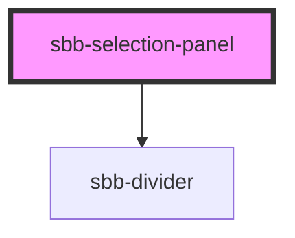

The `sbb-selection-panel` component wraps either a `sbb-checkbox` or a `sbb-radio-button` that can optionally toggle a content section.

The content section can be opened by checking the checkbox or if radio is selected. Additionally, clicking on all the upper area sets the checked state and therefore open the content; clicking on the content area does not toggle anything.

The selection panel can also be used inside a `sbb-radio-button-group` or a `sbb-checkbox-group`.

#### With radio button group

```html
<sbb-radio-button-group>
  <sbb-selection-panel>
    <sbb-card-badge slot="badge">%</sbb-card-badge>
     <sbb-radio-button>
       Value
       <span slot="subtext">Subtext</span>
       <span slot="suffix">
         <sbb-icon/>
         <span class="sbb-text-xs sbb-text--bold">CHF</span>
         <span class="sbb-text-m sbb-text--bold">40.00</span>
       </span>
     </sbb-radio-button>
     <div slot="content">
      Inner Content
     </div>
  </sbb-selection-panel>
</sbb-radio-button-group>
```

#### With checkbox group

```html
<sbb-checkbox-group>
  <sbb-selection-panel>
    <sbb-card-badge slot="badge">%</sbb-card-badge>
     <sbb-checkbox>
       Value
       <span slot="subtext">Subtext</span>
       <span slot="suffix">
         <sbb-icon/>
         <span class="sbb-text-xs sbb-text--bold">CHF</span>
         <span class="sbb-text-m sbb-text--bold">40.00</span>
       </span>
     </sbb-checkbox>
     <div slot="content">
      Inner Content
     </div>
  </sbb-selection-panel>
</sbb-checkbox-group>
```

As shown in the examples above, `sbb-checkbox` and `sbb-radio-button` placed in a `sbb-selection-panel` are extended with a slot named "subtext" for the subtext and a slot named "suffix" for the suffix items.

<!-- Auto Generated Below -->


## Properties

| Property           | Attribute           | Description                                    | Type                | Default   |
| ------------------ | ------------------- | ---------------------------------------------- | ------------------- | --------- |
| `borderless`       | `borderless`        | Whether the unselected panel has a border.     | `boolean`           | `false`   |
| `color`            | `color`             | The background color of the panel.             | `"milk" \| "white"` | `'white'` |
| `disableAnimation` | `disable-animation` | Whether the animation is enabled.              | `boolean`           | `false`   |
| `forceOpen`        | `force-open`        | Whether the content section is always visible. | `boolean`           | `false`   |


## Events

| Event        | Description                                                       | Type                                         |
| ------------ | ----------------------------------------------------------------- | -------------------------------------------- |
| `did-close`  | Emits whenever the content section is closed.                     | `CustomEvent<{ closeTarget: HTMLElement; }>` |
| `did-open`   | Emits whenever the content section is opened.                     | `CustomEvent<void>`                          |
| `will-close` | Emits whenever the content section begins the closing transition. | `CustomEvent<{ closeTarget: HTMLElement; }>` |
| `will-open`  | Emits whenever the content section starts the opening transition. | `CustomEvent<void>`                          |


## Slots

| Slot        | Description                                                        |
| ----------- | ------------------------------------------------------------------ |
| `"badge"`   | Use this slot to provide a `sbb-card-badge` (optional).            |
| `"content"` | Use this slot to provide custom content for the panel (optional).  |
| `"unnamed"` | Use this slot to provide a `sbb-checkbox` or a `sbb-radio-button`. |


## Dependencies

### Depends on

- [sbb-divider](../sbb-divider)

### Graph


----------------------------------------------


