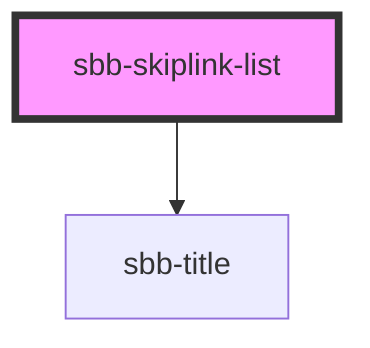

# sbb-skiplink-list

<!-- Auto Generated Below -->

## Properties

| Property       | Attribute       | Description                                                                                                      | Type                                     | Default     |
| -------------- | --------------- | ---------------------------------------------------------------------------------------------------------------- | ---------------------------------------- | ----------- |
| `size`         | `size`          | Text size of the nested sbb-link instances. This will overwrite the size attribute of nested sbb-link instances. | `"m" \| "s" \| "xs"`                     | `'m'`       |
| `titleContent` | `title-content` | The title text we want to show before the list.                                                                  | `string`                                 | `undefined` |
| `titleLevel`   | `title-level`   | The semantic level of the title, e.g. 2 = h2.                                                                    | `"1" \| "2" \| "3" \| "4" \| "5" \| "6"` | `'2'`       |

## Slots

| Slot        | Description                             |
| ----------- | --------------------------------------- |
| `"unnamed"` | Use this to provide links for the list. |

## Dependencies

### Depends on

- [sbb-title](../sbb-title)

### Graph

----------------------------------------------

