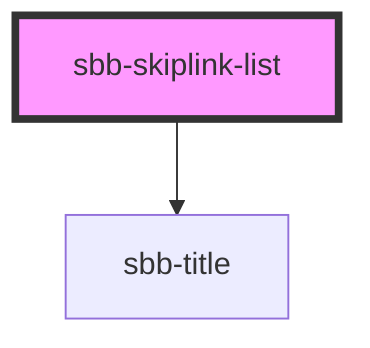

# sbb-skiplink-list

Skiplinks are lists of links which are shown only on focus.

The default `z-index` of the component is set to `1000`; to specify a custom stack order, the `z-index` can be changed by defining the CSS variable `--sbb-skiplink-z-index`.

## Usage

```html
  <sbb-skiplink-list title-content="Navigation Links">
    <sbb-link href='#'>Link 1</sbb-link>
    <sbb-link href='#'>Link 2</sbb-link>
    <sbb-link href='#'>Link 3</sbb-link>
  </sbb-skiplink-list>
```


## Properties

| Property       | Attribute       | Description                                      | Type                                     | Default     |
| -------------- | --------------- | ------------------------------------------------ | ---------------------------------------- | ----------- |
| `titleContent` | `title-content` | The title text we want to place before the list. | `string`                                 | `undefined` |
| `titleLevel`   | `title-level`   | The semantic level of the title, e.g. 2 = h2.    | `"1" \| "2" \| "3" \| "4" \| "5" \| "6"` | `'2'`       |


## Slots

| Slot        | Description                             |
| ----------- | --------------------------------------- |
| `"unnamed"` | Use this to provide links for the list. |


## Dependencies

### Depends on

- [sbb-title](../sbb-title)

### Graph


----------------------------------------------