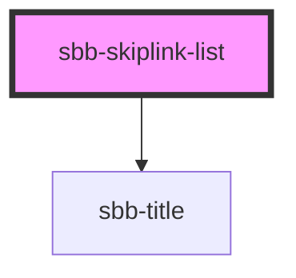

The `<sbb-skiplink-list>` is a component that can be used to collect one or more hidden `sbb-link`s,
which become visible only when focused, e.g., using the `Tab` key. 
When the component contains multiple link elements, only one of them is shown (the focused one), while the others stay visually hidden.

It has an optional `sbb-title` element, which is visually hidden too, but it's read from screen-readers, 
and it can be set using the `title-content` property.

```html
<sbb-skiplink-list title-level="2" title-content="Title text">
  <sbb-link href='https://www.sbb.ch/'>Content</sbb-link>
  <sbb-link href='https://www.sbb.ch/en/help-and-contact.html'>Contact</sbb-link>
  ...
</sbb-skiplink-list>
```

### Style

The default `z-index` of the component is set to `1000`; 
to specify a custom stack order, the `z-index` can be changed by defining the CSS variable `--sbb-skiplink-z-index`.

<!-- Auto Generated Below -->


## Properties

| Property       | Attribute       | Description                                      | Type                                     | Default     |
| -------------- | --------------- | ------------------------------------------------ | ---------------------------------------- | ----------- |
| `titleContent` | `title-content` | The title text we want to place before the list. | `string`                                 | `undefined` |
| `titleLevel`   | `title-level`   | The semantic level of the title, e.g. 2 = h2.    | `"1" \| "2" \| "3" \| "4" \| "5" \| "6"` | `'2'`       |


## Slots

| Slot        | Description                             |
| ----------- | --------------------------------------- |
| `"unnamed"` | Use this to provide links for the list. |


## Dependencies

### Depends on

- [sbb-title](../sbb-title)

### Graph


----------------------------------------------


