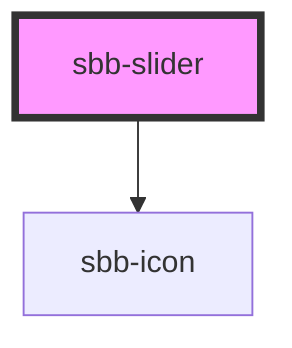

The `<sbb-slider>` is an input component that allows for the selection of a value within a range;
this can be set by consumers using the `min` and `max` properties (default values are 0 and 100).

The initial value can be set using the `value` property (string), or the `valueAsNumber` (number).
If no value is provided, by default it is set halfway between the minimum and maximum.

The component can optionally display two `<sbb-icon>`s at either end; 
consumers could set one/both of them using the `startIcon` and `endIcon` properties, 
or can provide their own using the two slots named `prefix` and `suffix`.

It is possible to display the component in disabled or readonly state by using the self-named properties.

Consumers can listen to the native `change` event on the `sbb-slider` component to intercept the input's change `event`;
the current value can be read from `event.target.value` or `event.target.valueAsNumber`.

The component can be used within a `<sbb-form-field>` component.

## Usage
Simple slider with default range and icons:

```html
<sbb-slider value="40" start-icon="circle-minus-small" end-icon="circle-plus-small"></sbb-slider>
```

Slider with no icons and custom range:

```html
<sbb-slider max="5" min="1" value="5"></sbb-slider>
```

Slider inside a `<sbb-form-field>`:

```html
<sbb-form-field label="Slider">
  <sbb-slider value="0"></sbb-slider>
</sbb-form-field>
```

## Accessibility

The `<sbb-slider>` has the following behaviour on keypress when focused:

| Key         | Action                                            |
|-------------|---------------------------------------------------|
| Right arrow | Increment the slider value by one (or one step).  |
| Up arrow    | Increment the slider value by one (or one step).  |
| Left arrow  | Decrement the slider value by one (or one step).  |
| Down arrow  | Decrement the slider value by one (or one step).  |
| Page up     | Increment the slider value by ten (or ten steps). |
| Page down   | Decrement the slider value by ten (or ten steps). |
| End         | Set the value to the maximum.                     |
| Home        | Set the value to the minimum.                     |


<!-- Auto Generated Below -->


## Properties

| Property        | Attribute         | Description                                                                                                                                    | Type      | Default     |
| --------------- | ----------------- | ---------------------------------------------------------------------------------------------------------------------------------------------- | --------- | ----------- |
| `disabled`      | `disabled`        | Disabled state for the inner HTMLInputElement.                                                                                                 | `boolean` | `false`     |
| `endIcon`       | `end-icon`        | Name of the icon at component's end, which will be forward to the nested `sbb-icon`.                                                           | `string`  | `undefined` |
| `form`          | `form`            | The <form> element to associate the inner HTMLInputElement with.                                                                               | `string`  | `undefined` |
| `max`           | `max`             | Maximum acceptable value for the inner HTMLInputElement.                                                                                       | `string`  | `'100'`     |
| `min`           | `min`             | Minimum acceptable value for the inner HTMLInputElement.                                                                                       | `string`  | `'0'`       |
| `name`          | `name`            | Name of the inner HTMLInputElement.                                                                                                            | `string`  | `''`        |
| `readonly`      | `readonly`        | Readonly state for the inner HTMLInputElement. Since the input range does not allow this attribute, it will be merged with the `disabled` one. | `boolean` | `false`     |
| `startIcon`     | `start-icon`      | Name of the icon at component's start, which will be forward to the nested `sbb-icon`.                                                         | `string`  | `undefined` |
| `value`         | `value`           | Value for the inner HTMLInputElement.                                                                                                          | `string`  | `''`        |
| `valueAsNumber` | `value-as-number` | Numeric value for the inner HTMLInputElement.                                                                                                  | `number`  | `undefined` |


## Events

| Event       | Description                                                                                                                         | Type               |
| ----------- | ----------------------------------------------------------------------------------------------------------------------------------- | ------------------ |
| `didChange` | <span style="color:red">**[DEPRECATED]**</span> only used for React. Will probably be removed once React 19 is available.<br/><br/> | `CustomEvent<any>` |


## Slots

| Slot       | Description                                            |
| ---------- | ------------------------------------------------------ |
| `"prefix"` | Slot to render an icon on the left side of the input.  |
| `"suffix"` | Slot to render an icon on the right side of the input. |


## Dependencies

### Depends on

- [sbb-icon](../sbb-icon)

### Graph


----------------------------------------------


