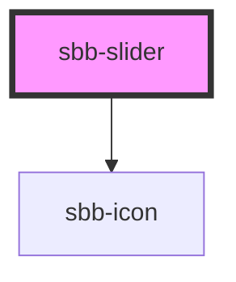

# sbb-slider

<!-- Auto Generated Below -->

## Properties

| Property    | Attribute    | Description                                                                                                                                    | Type      | Default     |
| ----------- | ------------ | ---------------------------------------------------------------------------------------------------------------------------------------------- | --------- | ----------- |
| `disabled`  | `disabled`   | Disabled state for the inner HTMLInputElement.                                                                                                 | `boolean` | `false`     |
| `endIcon`   | `end-icon`   | Name of the icon at component's end, which will be forward to the nested `sbb-icon`.                                                           | `string`  | `undefined` |
| `max`       | `max`        | Maximum acceptable value for the inner HTMLInputElement.                                                                                       | `string`  | `'100'`     |
| `min`       | `min`        | Minimum acceptable value for the inner HTMLInputElement.                                                                                       | `string`  | `'0'`       |
| `name`      | `name`       | Name of the inner HTMLInputElement.                                                                                                            | `string`  | `''`        |
| `readonly`  | `readonly`   | Readonly state for the inner HTMLInputElement. Since the input range does not allow this attribute, it will be merged with the `disabled` one. | `boolean` | `false`     |
| `startIcon` | `start-icon` | Name of the icon at component's start, which will be forward to the nested `sbb-icon`.                                                         | `string`  | `undefined` |
| `step`      | `step`       | The granularity of the possible values for the inner HTMLInputElement.                                                                         | `string`  | `''`        |
| `value`     | `value`      | Value for the inner HTMLInputElement.                                                                                                          | `string`  | `''`        |

## Events

| Event       | Description                                                         | Type                           |
| ----------- | ------------------------------------------------------------------- | ------------------------------ |
| `sbbChange` | Event emitted when the value of the inner HTMLInputElement changes. | `CustomEvent<SbbSliderChange>` |

## Slots

| Slot       | Description                                            |
| ---------- | ------------------------------------------------------ |
| `"prefix"` | Slot to render an icon on the left side of the input.  |
| `"suffix"` | Slot to render an icon on the right side of the input. |

## Dependencies

### Depends on

- [sbb-icon](../sbb-icon)

### Graph

----------------------------------------------

