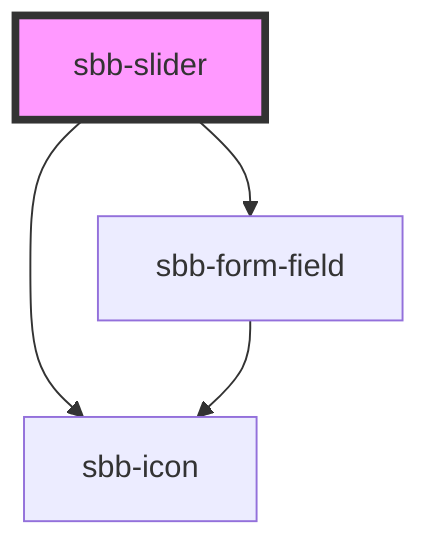

# sbb-slider

<!-- Auto Generated Below -->

## Properties

| Property    | Attribute    | Description | Type      | Default     |
| ----------- | ------------ | ----------- | --------- | ----------- |
| `disabled`  | `disabled`   |             | `boolean` | `false`     |
| `endIcon`   | `end-icon`   |             | `string`  | `undefined` |
| `max`       | `max`        |             | `string`  | `'100'`     |
| `min`       | `min`        |             | `string`  | `'0'`       |
| `name`      | `name`       |             | `string`  | `''`        |
| `readonly`  | `readonly`   |             | `boolean` | `false`     |
| `startIcon` | `start-icon` |             | `string`  | `undefined` |
| `step`      | `step`       |             | `string`  | `''`        |
| `value`     | `value`      |             | `string`  | `''`        |

## Events

| Event       | Description | Type                           |
| ----------- | ----------- | ------------------------------ |
| `sbbChange` |             | `CustomEvent<SbbSliderChange>` |

## Dependencies

### Depends on

- [sbb-form-field](../sbb-form-field)
- [sbb-icon](../sbb-icon)

### Graph

----------------------------------------------

