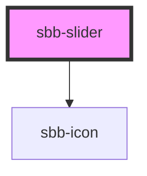

# sbb-slider

<!-- Auto Generated Below -->

## Properties

| Property   | Attribute  | Description | Type      | Default |
| ---------- | ---------- | ----------- | --------- | ------- |
| `disabled` | `disabled` |             | `boolean` | `false` |
| `max`      | `max`      |             | `string`  | `'100'` |
| `min`      | `min`      |             | `string`  | `'0'`   |
| `name`     | `name`     |             | `string`  | `''`    |
| `readonly` | `readonly` |             | `boolean` | `false` |
| `step`     | `step`     |             | `string`  | `''`    |
| `value`    | `value`    |             | `string`  | `''`    |

## Events

| Event       | Description | Type                           |
| ----------- | ----------- | ------------------------------ |
| `sbbChange` |             | `CustomEvent<SbbSliderChange>` |

## Dependencies

### Depends on

- [sbb-icon](../sbb-icon)

### Graph

----------------------------------------------

