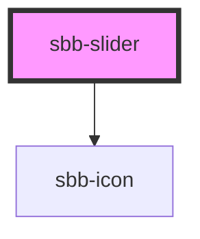

`<sbb-slider>` is used to display an input of range type, that lets the user specify a numeric value which must be no less than a given value, and no more than another given value. 


## Usage
Simple slider
```html
<sbb-slider max="100" min="0" value="40" start-icon="walk-slow-small" end-icon="walk-fast-small"></sbb-slider>
```

Slider with steps
```html
<sbb-slider max="100" min="0" step="10" value="40" end-icon="walk-fast-small" start-icon="walk-slow-small"></sbb-slider>
```

Slider inserted in form field
```html
<sbb-form-field>
  <sbb-slider max="100" min="0" value="40" start-icon="walk-slow-small" end-icon="walk-fast-small"></sbb-slider>
</sbb-form-field>
```

## Accessibility
** TBD **


<!-- Auto Generated Below -->


## Properties

| Property                   | Attribute                   | Description                                                                                                                                    | Type      | Default     |
| -------------------------- | --------------------------- | ---------------------------------------------------------------------------------------------------------------------------------------------- | --------- | ----------- |
| `accessibilityDescribedby` | `accessibility-describedby` | This will be forwarded as aria-describedby to the relevant nested element.                                                                     | `string`  | `undefined` |
| `accessibilityLabel`       | `accessibility-label`       | This will be forwarded as aria-label to the relevant nested element.                                                                           | `string`  | `undefined` |
| `accessibilityLabelledby`  | `accessibility-labelledby`  | This will be forwarded as aria-labelledby to the relevant nested element.                                                                      | `string`  | `undefined` |
| `disabled`                 | `disabled`                  | Determines whether the input is disabled.                                                                                                      | `boolean` | `false`     |
| `readonly`                 | `readonly`                  | Determines whether the input is in readonly state.                                                                                             | `boolean` | `false`     |
| `endIcon` _(required)_     | `end-icon`                  | Name of the icon at component's end, which will be forward to the nested `sbb-icon`.                                                           | `string`  | `undefined` |
| `max`                      | `max`                       | Maximum acceptable value for the input.                                                                                                        | `string`  | `'100'`     |
| `min`                      | `min`                       | Minimum acceptable value for the input.                                                                                                        | `string`  | `'0'`       |
| `name`                     | `name`                      | Name of the input.                                                                                                                             | `string`  | `''`        |
| `startIcon` _(required)_   | `start-icon`                | Name of the icon at component's start, which will be forward to the nested `sbb-icon`.                                                         | `string`  | `undefined` |
| `step`                     | `step`                      | The size of each movement (increment, decrement or jump between values) of the slider control.                                                 | `string`  | `''`        |
| `value`                    | `value`                     | Value for the input.                                                                                                                           | `string`  | `''`        |
| `valueAsNumber`            | `value-as-number`           | Numeric value for the input.                                                                                                                   | `number`  | `undefined` |


## Events

| Event       | Description                                                         | Type                           |
| ----------- | ------------------------------------------------------------------- | ------------------------------ |
| `sbbChange` | Emits the event on calue change.                                    | `CustomEvent<SbbSliderChange>` |


## Slots

| Slot       | Description                                            |
| ---------- | ------------------------------------------------------ |
| `"prefix"` | Slot to render an icon on the left side of the input.  |
| `"suffix"` | Slot to render an icon on the right side of the input. |


## Dependencies

### Depends on

- [sbb-icon](../sbb-icon)

### Graph


----------------------------------------------


