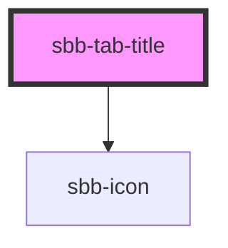

Use the `sbb-tab-title` tag in combination with the `sbb-tab-group` component in order to display a tab label within the tab bar.

```html
<sbb-tab-group initial-selected-index="0" amount="123">
  <sbb-tab-title icon-name="app-icon-small">
    Tab Label
  </sbb-tab-title>
</sbb-tab-group>
```

Slotted amount:

```html
<sbb-tab-group initial-selected-index="0">
  <sbb-tab-title icon-name="app-icon-small">
    Tab Label
    <span slot="amount">123</span> <!-- optional -->
  </sbb-tab-title>
</sbb-tab-group>
```

<!-- Auto Generated Below -->


## Properties

| Property   | Attribute   | Description                                                                                                                                                   | Type                                     | Default     |
| ---------- | ----------- | ------------------------------------------------------------------------------------------------------------------------------------------------------------- | ---------------------------------------- | ----------- |
| `active`   | `active`    | Active tab state                                                                                                                                              | `boolean`                                | `undefined` |
| `amount`   | `amount`    | Amount displayed inside the tab.                                                                                                                              | `string`                                 | `undefined` |
| `disabled` | `disabled`  | Disabled tab state                                                                                                                                            | `boolean`                                | `undefined` |
| `iconName` | `icon-name` | The icon name we want to use, choose from the small icon variants from the ui-icons category from here https://icons.app.sbb.ch.                              | `string`                                 | `undefined` |
| `level`    | `level`     | The level will correspond to the heading tag generated in the title. Use this property to generate the appropriate header tag, taking SEO into consideration. | `"1" \| "2" \| "3" \| "4" \| "5" \| "6"` | `'1'`       |


## Slots

| Slot        | Description                                                                                       |
| ----------- | ------------------------------------------------------------------------------------------------- |
| `"amount"`  | Provide a number to show an amount to the right of the title.                                     |
| `"icon"`    | Use this slot to display an icon to the left of the title, by providing the `sbb-icon` component. |
| `"unnamed"` | This slot will show the provided tab title.                                                       |


## Dependencies

### Depends on

- [sbb-icon](../sbb-icon)

### Graph


----------------------------------------------


