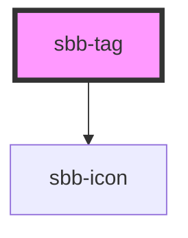

# sbb-tag

The `sbb-tag` is a component that can be used as a filter in order to categorize a large amount of information.

It could be active or not depending on the value of the `checked` attribute, 
and it could be displayed in disabled or required state by using the self-named properties.
The component has also a `value` property, which is bound to its inner HTMLInputElement.

It is possible to provide a label via an unnamed slot; the component can optionally display a `<sbb-icon>` 
at the component start using the `iconName` property or via custom SVG using the `icon` slot.
It's also possible to display an amount at the component end using the `amount` slot.

Consumers can listen to the native `change` event on the `sbb-tag` component to intercept the input's change;
the current state can be read from `event.target.checked`, while the value from `event.target.value`.

## Usage

Checked:

```html
<sbb-tag checked="true" value="All">All</sbb-tag>
```

Unchecked disabled with icon:

```html
<sbb-tag disabled="true" value="All" icon-name="circle-information-small">All</sbb-tag>
```

Unchecked required with custom icon and amount:

```html
<sbb-tag required="true" value="All">
  <sbb-icon slot="icon" name="pie-small" />
  All
  <span slot="amount"></span>
</sbb-tag>
```

## Accessibility

The component uses an internal `<input type="checkbox"/>` element to provide an accessible experience.
This internal checkbox receives focus and is automatically labelled by the text content of the
`<sbb-tag>` element.


<!-- Auto Generated Below -->


## Properties

| Property                   | Attribute                   | Description                                                                                                                                         | Type      | Default                 |
| -------------------------- | --------------------------- | --------------------------------------------------------------------------------------------------------------------------------------------------- | --------- | ----------------------- |
| `accessibilityDescribedby` | `accessibility-describedby` | The aria-describedby prop for the hidden input.                                                                                                     | `string`  | `undefined`             |
| `accessibilityLabel`       | `accessibility-label`       | The aria-label prop for the hidden input.                                                                                                           | `string`  | `undefined`             |
| `accessibilityLabelledby`  | `accessibility-labelledby`  | The aria-labelledby prop for the hidden input.                                                                                                      | `string`  | `undefined`             |
| `checked`                  | `checked`                   | Whether the internal hidden checkbox is checked.                                                                                                    | `boolean` | `undefined`             |
| `disabled`                 | `disabled`                  | Whether the internal hidden checkbox is disabled.                                                                                                   | `boolean` | `false`                 |
| `iconName`                 | `icon-name`                 | The icon name we want to use, choose from the small icon variants from the ui-icons category from here https://lyne.sbb.ch/tokens/icons (optional). | `string`  | `undefined`             |
| `required`                 | `required`                  | Whether the internal hidden checkbox is required.                                                                                                   | `boolean` | `false`                 |
| `tagId`                    | `tag-id`                    | Id of the internal hidden checkbox element - default id will be set automatically.                                                                  | `string`  | ``sbb-tag-${++nextId}`` |
| `value`                    | `value`                     | Value of internal hidden checkbox.                                                                                                                  | `string`  | `undefined`             |


## Events

| Event       | Description                                                                                                                         | Type               |
| ----------- | ----------------------------------------------------------------------------------------------------------------------------------- | ------------------ |
| `didChange` | <span style="color:red">**[DEPRECATED]**</span> only used for React. Will probably be removed once React 19 is available.<br/><br/> | `CustomEvent<any>` |


## Slots

| Slot        | Description                                                                                   |
| ----------- | --------------------------------------------------------------------------------------------- |
| `"amount"`  | Provide an amount to show it at the component end.                                            |
| `"icon"`    | Use this slot to display an icon at the component start, by providing a `sbb-icon` component. |
| `"unnamed"` | This slot will show the provided tag label.                                                   |


## Dependencies

### Depends on

- [sbb-icon](../sbb-icon)

### Graph


----------------------------------------------


