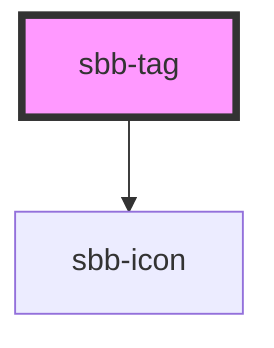

# sbb-tag

<!-- Auto Generated Below -->

## Properties

| Property                   | Attribute                   | Description                                                                                                                                         | Type      | Default                 |
| -------------------------- | --------------------------- | --------------------------------------------------------------------------------------------------------------------------------------------------- | --------- | ----------------------- |
| `accessibilityDescribedby` | `accessibility-describedby` | The aria-describedby prop for the hidden input.                                                                                                     | `string`  | `undefined`             |
| `accessibilityLabel`       | `accessibility-label`       | The aria-label prop for the hidden input.                                                                                                           | `string`  | `undefined`             |
| `accessibilityLabelledby`  | `accessibility-labelledby`  | The aria-labelledby prop for the hidden input.                                                                                                      | `string`  | `undefined`             |
| `active`                   | `active`                    | Active tab state                                                                                                                                    | `boolean` | `undefined`             |
| `checked`                  | `checked`                   | Whether the checkbox is checked.                                                                                                                    | `boolean` | `undefined`             |
| `disabled`                 | `disabled`                  | Whether the checkbox is disabled.                                                                                                                   | `boolean` | `false`                 |
| `iconName`                 | `icon-name`                 | The icon name we want to use, choose from the small icon variants from the ui-icons category from here https://lyne.sbb.ch/tokens/icons (optional). | `string`  | `undefined`             |
| `required`                 | `required`                  | Whether the checkbox is required.                                                                                                                   | `boolean` | `false`                 |
| `tagId`                    | `tag-id`                    | Id of the internal input element - default id will be set automatically.                                                                            | `string`  | ``sbb-tag-${++nextId}`` |
| `value`                    | `value`                     | Value of checkbox.                                                                                                                                  | `string`  | `undefined`             |

## Events

| Event       | Description                                                                                                                         | Type               |
| ----------- | ----------------------------------------------------------------------------------------------------------------------------------- | ------------------ |
| `didChange` | **[DEPRECATED]** only used for React. Will probably be removed once React 19 is available.   | `CustomEvent<any>` |

## Slots

| Slot        | Description                                                                                   |
| ----------- | --------------------------------------------------------------------------------------------- |
| `"amount"`  | Provide an `sbb-tab-amount` to show an amount at the component end.                           |
| `"icon"`    | Use this slot to display an icon at the component start, by providing a `sbb-icon` component. |
| `"unnamed"` | This slot will show the provided tag label.                                                   |

## Dependencies

### Depends on

- [sbb-icon](../sbb-icon)

### Graph

----------------------------------------------

