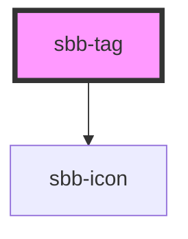

The `sbb-tag` is a component that can be used as a filter in order to categorize a large amount of information.
It's intended to be used inside an `<sbb-tag-group>`.

It is possible to provide a label via an unnamed slot; the component can optionally display a `<sbb-icon>` 
at the component start using the `iconName` property or via custom content using the `icon` slot.
It's also possible to display a numeric amount at the component's end using the `amount` slot.

Consumers can listen to the native `change` and `input` events on the `<sbb-tag>`.
The current state can be read from `event.target.checked`, while the value from `event.target.value`.
It's recommended to check the parent's `<sbb-tag-group>` for the value.

## Usage

Checked:

```html
<sbb-tag checked value="All" amount="123">All</sbb-tag>
```

Unchecked disabled with icon:

```html
<sbb-tag disabled value="All" icon-name="circle-information-small">All</sbb-tag>
```

Unchecked required with custom icon and amount:

```html
<sbb-tag value="All">
  <sbb-icon slot="icon" name="pie-small" />
  All
  <span slot="amount">123</span>
</sbb-tag>
```

## Accessibility

The component imitates an `<button>` element to provide an accessible experience. 
The state is reflected via `aria-pressed` attribute.


<!-- Auto Generated Below -->


## Properties

| Property   | Attribute   | Description                                                                                                                            | Type      | Default     |
| ---------- | ----------- | -------------------------------------------------------------------------------------------------------------------------------------- | --------- | ----------- |
| `amount`   | `amount`    | Amount displayed inside the tag.                                                                                                       | `string`  | `undefined` |
| `checked`  | `checked`   | Whether the toggle is checked.                                                                                                         | `boolean` | `false`     |
| `disabled` | `disabled`  | Whether the tag is disabled.                                                                                                           | `boolean` | `false`     |
| `form`     | `form`      | The <form> element to associate the button with.                                                                                       | `string`  | `undefined` |
| `iconName` | `icon-name` | The icon name we want to use, choose from the small icon variants from the ui-icons category from https://icons.app.sbb.ch (optional). | `string`  | `undefined` |
| `name`     | `name`      | The name attribute to use for the button.                                                                                              | `string`  | `undefined` |
| `value`    | `value`     | Value of the tag.                                                                                                                      | `string`  | `undefined` |


## Events

| Event          | Description                                                                                                                         | Type                                                        |
| -------------- | ----------------------------------------------------------------------------------------------------------------------------------- | ----------------------------------------------------------- |
| `change`       | Change event emitter                                                                                                                | `CustomEvent<any>`                                          |
| `didChange`    | <span style="color:red">**[DEPRECATED]**</span> only used for React. Will probably be removed once React 19 is available.<br/><br/> | `CustomEvent<any>`                                          |
| `input`        | Input event emitter                                                                                                                 | `CustomEvent<any>`                                          |
| `state-change` | Internal event that emits whenever the state of the tag in relation to the parent toggle changes.                                   | `CustomEvent<TagStateChangeChecked \| TagStateChangeValue>` |


## Slots

| Slot        | Description                                                                                   |
| ----------- | --------------------------------------------------------------------------------------------- |
| `"amount"`  | Provide an amount to show it at the component end.                                            |
| `"icon"`    | Use this slot to display an icon at the component start, by providing a `sbb-icon` component. |
| `"unnamed"` | This slot will show the provided tag label.                                                   |


## Dependencies

### Depends on

- [sbb-icon](../sbb-icon)

### Graph


----------------------------------------------


