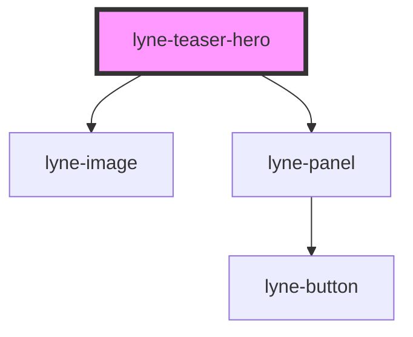

# lyne-teaser-hero

<!-- Auto Generated Below -->

## Properties

| Property                  | Attribute              | Description                                                                                                                                                           | Type                | Default     |
| ------------------------- | ---------------------- | --------------------------------------------------------------------------------------------------------------------------------------------------------------------- | ------------------- | ----------- |
| `buttonText` _(required)_ | `button-text`          | Button text property for lyne-panel. See lyne-panel for additional info                                                                                               | `string`            | `undefined` |
| `imageLoading`            | `image-loading`        | Image loading property. See lyne-image for additional info                                                                                                            | `"eager" \| "lazy"` | `'eager'`   |
| `imageSrc` _(required)_   | `image-src`            | Image source property for lyne-image. See lyne-image for additional info                                                                                              | `string`            | `undefined` |
| `link` _(required)_       | `link`                 | Link to open if the teaser is clicked/pressed.                                                                                                                        | `string`            | `undefined` |
| `newWindowInfoText`       | `new-window-info-text` | If `openInNewWindow` is set, you should provide according information which will be read aloud for screenreader users (e.g. "Link target will open in a new window"). | `string`            | `undefined` |
| `openInNewWindow`         | `open-in-new-window`   | If set, the link will be opened in a new window.                                                                                                                      | `boolean`           | `undefined` |
| `text` _(required)_       | `text`                 | Text property for lyne-panel. See lyne-panel for additional info                                                                                                      | `string`            | `undefined` |

## Dependencies

### Depends on

- [lyne-image](../lyne-image)
- [lyne-panel](../lyne-panel)

### Graph

----------------------------------------------

