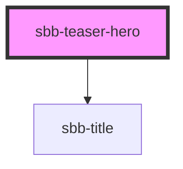

# sbb-teaser-hero

<!-- Auto Generated Below -->

## Properties

| Property                          | Attribute              | Description                                                                                                                                                           | Type      | Default     |
| --------------------------------- | ---------------------- | --------------------------------------------------------------------------------------------------------------------------------------------------------------------- | --------- | ----------- |
| `accessibilityTitle` _(required)_ | `accessibility-title`  | Teaser title text, visually hidden,  necessary for screenreaders                                                                                                      | `string`  | `undefined` |
| `link` _(required)_               | `link`                 | Link for the hero teaser.                                                                                                                                             | `string`  | `undefined` |
| `newWindowInfoText`               | `new-window-info-text` | If `openInNewWindow` is set, you should provide according information which will be read aloud for screenreader users (e.g. "Link target will open in a new window"). | `string`  | `undefined` |
| `openInNewWindow`                 | `open-in-new-window`   | If set, the link will be opened in a new window.                                                                                                                      | `boolean` | `undefined` |

## Slots

| Slot                           | Description                      |
| ------------------------------ | -------------------------------- |
| `"hiddenTitle"`                | to place the accessibility title |
| `"image"`                      | to render the image              |
| `"panel- to render the panel"` |                                  |

## Dependencies

### Depends on

- [sbb-title](../sbb-title)

### Graph

----------------------------------------------

