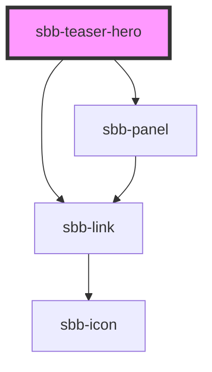

# sbb-teaser-hero

For this component you can either use slots or props to render the panel component.

# Usage with slots:

````
<sbb-teaser-hero {...args}>
  <sbb-panel slot="panel">
    <span slot="text">Sbb teaser hero with Slots</span>
    <sbb-link slot="link" negative>
      Mehr erfahren
    </sbb-link>
  </sbb-panel>

  <sbb-image slot="image"/>
</sbb-teaser-hero>
```

# Usage with props and image slot:

```
<sbb-teaser-hero {...args}>
  <sbb-image slot="image" />
</sbb-teaser-hero>
```


<!-- Auto Generated Below -->


## Properties

| Property                          | Attribute              | Description                                                                                                                                                           | Type      | Default     |
| --------------------------------- | ---------------------- | --------------------------------------------------------------------------------------------------------------------------------------------------------------------- | --------- | ----------- |
| `accessibilityTitle` _(required)_ | `accessibility-title`  | Teaser title text, visually hidden,  necessary for screenreaders                                                                                                      | `string`  | `undefined` |
| `link` _(required)_               | `link`                 | Link for the hero teaser.                                                                                                                                             | `string`  | `undefined` |
| `newWindowInfoText`               | `new-window-info-text` | If `openInNewWindow` is set, you should provide according information which will be read aloud for screenreader users (e.g. "Link target will open in a new window"). | `string`  | `undefined` |
| `openInNewWindow`                 | `open-in-new-window`   | If set, the link will be opened in a new window.                                                                                                                      | `boolean` | `undefined` |
| `panelLinkText` _(required)_      | `panel-link-text`      | Panel link text for the hero teaser.                                                                                                                                  | `string`  | `undefined` |
| `panelText` _(required)_          | `panel-text`           | Panel Text for the hero teaser.                                                                                                                                       | `string`  | `undefined` |


## Slots

| Slot      | Description         |
| --------- | ------------------- |
| `"image"` | to render the image |
| `"panel"` | to render the panel |


## Dependencies

### Depends on

- [sbb-panel](../sbb-panel)
- [sbb-link](../sbb-link)

### Graph


----------------------------------------------


