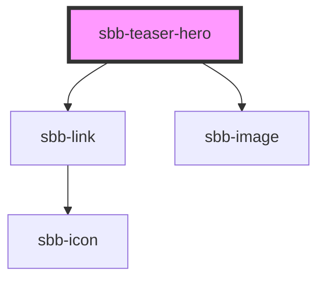

The `sbb-teaser-hero` is a component with a background image and an action call within a panel;
it should be an eye-catcher and should have an emotional effect on the user with its large image component.

### Slots

It is possible to provide the panel label via an unnamed slot, 
while the link text can be provided using the `link-content` slot or the `linkContent` property;
similarly, the background image can be provided using the `image` slot or the `imageSrc` property.

```html
<sbb-teaser-hero href="https://www.sbb.ch" link-content="Find out more" image-src="https://path-to-source" image-alt="SBB CFF FFS Employee">
  Break out and explore castles and palaces.
</sbb-teaser-hero>

<sbb-teaser-hero href="https://www.sbb.ch">
  Break out and explore castles and palaces.
  <sbb-image slot="image" image-src="https://path-to-source" alt="SBB CFF FFS Employee"/>
  <span slot="link-content">Find out more</span>
</sbb-teaser-hero>
```

## Accessibility

The description text is wrapped into an `p` element to guarantee the semantic meaning.

Avoid slotting block elements (e.g. `div`) as this violates semantic rules and can have negative effects on screen readers.

<!-- Auto Generated Below -->


## Properties

| Property      | Attribute      | Description                                                       | Type     | Default     |
| ------------- | -------------- | ----------------------------------------------------------------- | -------- | ----------- |
| `href`        | `href`         | The href value you want to link to.                               | `string` | `undefined` |
| `imageAlt`    | `image-alt`    | Image alt text will be passed to `sbb-image`.                     | `string` | `undefined` |
| `imageSrc`    | `image-src`    | Image src will be passed to `sbb-image`.                          | `string` | `undefined` |
| `linkContent` | `link-content` | Panel link text.                                                  | `string` | `undefined` |
| `rel`         | `rel`          | The relationship of the linked URL as space-separated link types. | `string` | `undefined` |
| `target`      | `target`       | Where to display the linked URL.                                  | `string` | `undefined` |


## Slots

| Slot             | Description                                |
| ---------------- | ------------------------------------------ |
| `"image"`        | the background image, can be a `sbb-image` |
| `"link-content"` | link content of the panel                  |
| `"unnamed"`      | text content of panel                      |


## Dependencies

### Depends on

- [sbb-link](../sbb-link)
- [sbb-image](../sbb-image)

### Graph


----------------------------------------------


