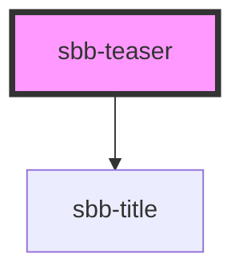

The `sbb-teaser` is a component which can display an image with a caption, and it behaves like a link on user interaction.

### Slots

The component displays the `image`, the `title` and the `description` in the self-named slots.

```html
<sbb-teaser href='https://www.sbb.ch'>
  
  <span slot="title"> Title </span>
  <span slot="description"> A brief description. </span>
</sbb-teaser>
```

The title level can be set by the consumer using the `titleLevel` property.

## Accessibility

It's important to set the `accessibilityLabel` property, which describes the `sbb-teaser` for screen-reader users.

The description text is wrapped into an `<p>` element to guarantee the semantic meaning.

Avoid slotting block elements (e.g. `<div>`) as this violates semantic rules and can have negative effects on screen readers.

<!-- Auto Generated Below -->


## Properties

| Property     | Attribute     | Description                                                                                                                   | Type                                     | Default     |
| ------------ | ------------- | ----------------------------------------------------------------------------------------------------------------------------- | ---------------------------------------- | ----------- |
| `href`       | `href`        | The href value you want to link to.                                                                                           | `string`                                 | `undefined` |
| `isStacked`  | `is-stacked`  | Teaser variant - when this is true the text-content will be under the image otherwise it will be displayed next to the image. | `boolean`                                | `undefined` |
| `rel`        | `rel`         | The relationship of the linked URL as space-separated link types.                                                             | `string`                                 | `undefined` |
| `target`     | `target`      | Where to display the linked URL.                                                                                              | `string`                                 | `undefined` |
| `titleLevel` | `title-level` | Heading level of the sbb-title element (e.g. h1-h6).                                                                          | `"1" \| "2" \| "3" \| "4" \| "5" \| "6"` | `'5'`       |


## Slots

| Slot            | Description                         |
| --------------- | ----------------------------------- |
| `"description"` | Slot used to render the description |
| `"image"`       | Slot used to render the image       |
| `"title"`       | Slot used to render the title       |


## Dependencies

### Depends on

- [sbb-title](../sbb-title)

### Graph


----------------------------------------------


